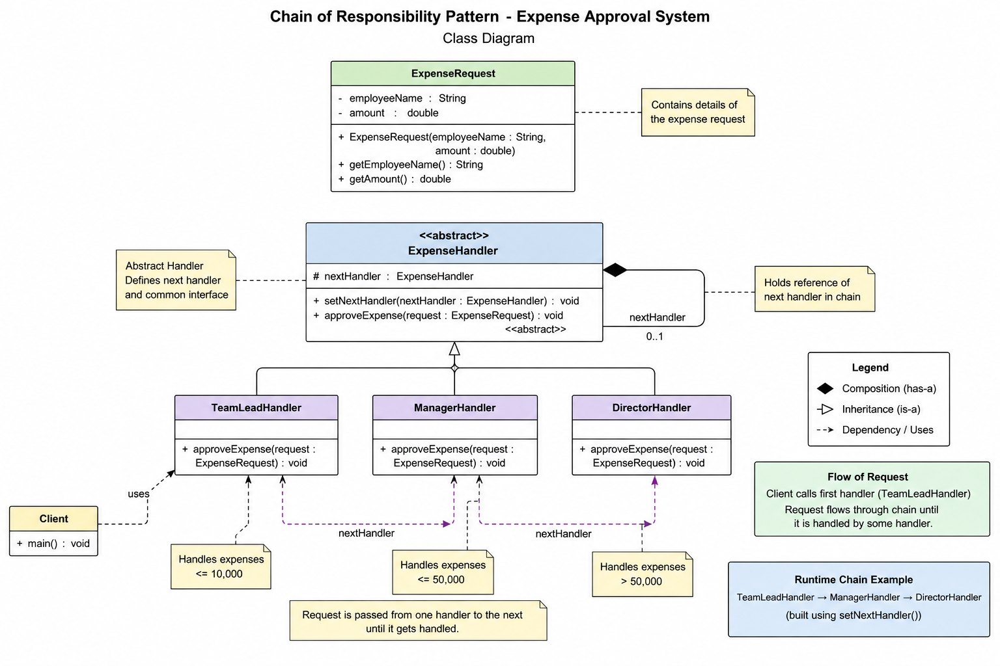

# Chain of Responsibility Pattern

## Definition

Chain of Responsibility is a behavioral design pattern where a request moves through a chain of handlers until one handler processes it.

Each handler decides:

- Handle request
- OR forward request to next handler

---

# Core Idea

```text
Pass request through multiple handlers dynamically.
```

---

# Why Use It?

- Removes large if-else/switch statements
- Creates loose coupling
- Supports dynamic request processing
- Follows Open/Closed Principle
- Encapsulates responsibilities

---

# Real World Examples

- Expense approval system
- Logger framework
- Authentication middleware
- Customer support escalation
- ATM cash dispenser

---

# Structure

```text
Client
   |
   v
Handler1 -> Handler2 -> Handler3
```

---

# Main Components

## 1. Abstract Handler

Contains:
- next handler reference
- forwarding logic contract

## 2. Concrete Handlers

Actual processing logic.

Examples:
- TeamLeadHandler
- ManagerHandler
- DirectorHandler

## 3. Chain Linking

```java
handler1.setNextHandler(handler2);
```

---

# Request Flow

```text
Client
   |
   v
Handler A
   |
   v
Handler B
   |
   v
Handler C
```

Each handler checks:

```text
Can I handle request?
```

If YES:
```text
Process request
```

Else:
```text
Forward to next handler
```

---

# Runtime Polymorphism

```java
ExpenseHandler handler = new TeamLeadHandler();
```

Method call resolved at runtime.

---

# HAS-A Relationship

```text
Handler HAS-A next handler
```

Used for chain creation.

---

# IS-A Relationship

```text
TeamLeadHandler IS-A ExpenseHandler
```

Used for polymorphism.

---

# Pros

- Flexible
- Extensible
- Loose coupling
- Cleaner code
- Dynamic request routing

---

# Cons

- Hard debugging
- Chain order matters
- Request may go unhandled

---

# Difference from Command Pattern

| Command | Chain of Responsibility |
|---|---|
| Encapsulates request | Passes request through chain |
| One receiver executes | Multiple handlers inspect |
| Focus on action | Focus on delegation |

---

# Best Use Cases

Use when:
- multiple objects can process request
- request processor unknown beforehand
- dynamic processing required

Avoid when:
- simple direct logic is enough
- chain becomes overly complex
- performance is critical

---

# Key Insight

Chain of Responsibility separates:

```text
REQUEST SENDER
FROM
REQUEST HANDLER
```

Sender does not know who handles request.
# Class Diagram
