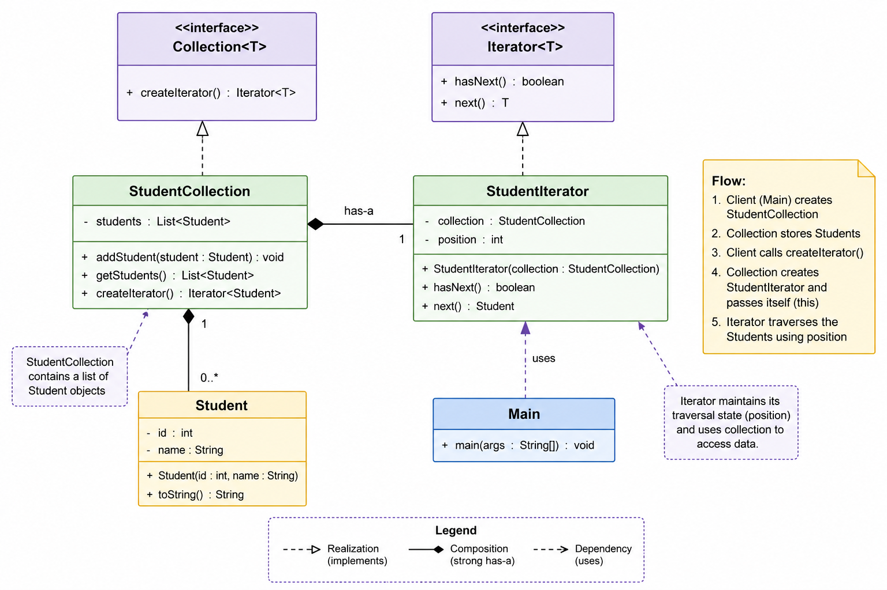

# Iterator Pattern (Behavioral Design Pattern)

# What is Iterator Pattern?

Iterator Pattern provides a way to traverse elements of a collection without exposing its internal structure.

Instead of directly accessing:
- array indexes
- linked list nodes
- tree nodes

client uses an iterator object.

The iterator knows:
- how to move
- where current position is
- how to fetch next element

---

# Real-World Analogy

Think of a music playlist.

You only use:
- next
- previous
- hasNext

You do NOT know:
- how songs are stored
- database structure
- indexing logic

Iterator acts like a traversal controller.

---

# Main Goal

Separate:

```text
DATA STORAGE
FROM
DATA TRAVERSAL
```

Collection handles:
```text
storing data
```

Iterator handles:
```text
moving through data
```

---

# Why is Iterator Pattern Used?

Without iterator:
- client depends on collection structure
- traversal logic gets duplicated
- encapsulation breaks

Iterator Pattern hides traversal implementation from the client.

---

# Problems It Solves

## Problem 1 — Client becomes structure-dependent

Bad:

```java
for(int i=0; i<list.size(); i++)
```

Client now knows:
- indexing
- internal structure

---

## Problem 2 — Traversal logic duplication

Every client writes traversal logic separately.

---

## Problem 3 — Encapsulation breaks

Client directly accesses collection internals.

---

# Mental Model

Collection says:

```text
I store the data.
```

Iterator says:

```text
I know how to move through the data.
```

Client says:

```text
I only want elements one by one.
```

---

# Core Components

---

# 1. Iterator Interface

Defines traversal behavior.

```java
public interface Iterator<T> {

    boolean hasNext();

    T next();
}
```

---

# Responsibility

- moving cursor
- checking next element
- returning current element

---

# 2. Collection Interface

Defines iterator creation behavior.

```java
public interface Collection<T> {

    Iterator<T> createIterator();
}
```

---

# Responsibility

- creating iterator
- hiding traversal creation logic

---

# 3. Concrete Collection

Example:

```java
StudentCollection
```

Stores actual data internally.

Example:

```java
private List<Student> students;
```

---

# Responsibility

- storing data
- managing data
- creating iterator

NOT traversal.

---

# 4. Concrete Iterator

Example:

```java
StudentIterator
```

Handles traversal logic.

---

# Responsibility

- maintaining cursor
- fetching next element
- traversal flow

NOT data storage.

---

# Full Object Relationship

```text
Main
  |
  ---> StudentCollection
            |
            ---> List<Student>

  ---> StudentIterator
            |
            ---> StudentCollection
```

---

# Important HAS-A Relationships

## StudentCollection HAS-A List<Student>

Because:
collection stores students.

```java
private List<Student> students;
```

---

## StudentIterator HAS-A StudentCollection

Because:
iterator needs collection to traverse data.

```java
private StudentCollection collection;
```

---

# Important IS-A Relationships

## StudentIterator IS-A Iterator

```java
implements Iterator<Student>
```

Because:
StudentIterator follows iterator behavior.

---

## StudentCollection IS-A Collection

```java
implements Collection<Student>
```

Because:
StudentCollection can create iterator.

---

# HAS-A vs IS-A Rule

---

# HAS-A

Use composition when object NEEDS another object to work.

Example:

```text
Car HAS-A Engine
Iterator HAS-A Collection
```

Code:

```java
private Collection collection;
```

---

# IS-A

Use inheritance/interface when statement makes sense.

Example:

```text
Dog IS-A Animal
StudentIterator IS-A Iterator
```

Code:

```java
implements Iterator
```

---

# Why Iterator Needs Collection Reference?

Iterator must access:
- collection data
- collection size
- traversal state

Without collection reference:
iterator cannot traverse.

---

# Constructor Injection

```java
public StudentIterator(StudentCollection collection) {
    this.collection = collection;
}
```

Why?

Because iterator depends on collection.

Collection is passed through constructor so iterator becomes ready immediately.

---

# Why `this` is Passed?

Inside collection:

```java
return new StudentIterator(this);
```

`this` means:

```text
current StudentCollection object
```

Iterator receives same collection reference.

---

# Internal Cursor Concept

Iterator maintains traversal state.

Example:

```java
private int position = 0;
```

This is cursor position.

---

# Cursor Movement Example

Suppose:

```text
[A, B, C]
```

Initially:

```text
position = 0
```

---

## next()

Returns:

```text
A
```

Then:

```text
position = 1
```

---

## next()

Returns:

```text
B
```

Then:

```text
position = 2
```

---

## hasNext()

Checks:

```java
position < size
```

When false:
traversal stops.

---

# Why Traversal is Separated?

Because traversal is different responsibility.

Collection should focus on:
- storing data

Iterator should focus on:
- traversal logic

This follows:

```text
SRP (Single Responsibility Principle)
```

---

# Why Not Traverse Inside Collection?

Bad:

```java
collection.printStudents();
```

Problem:
- collection handles too many responsibilities
- traversal logic becomes tightly coupled

Iterator separates concerns cleanly.

---

# Why Not Expose List Directly?

Bad:

```java
collection.getStudents()
```

Then client writes:

```java
for(int i=0; i<list.size(); i++)
```

Problems:
- client depends on structure
- encapsulation breaks
- traversal logic leaks outside

---

# Generic Iterator

Using generics:

```java
Iterator<T>
```

allows iterator to work with:
- Student
- Book
- Employee
- Any object

Examples:

```java
Iterator<Student>
Iterator<Book>
Iterator<Employee>
```

---

# Complete Java Example

---

# Student.java

```java
public class Student {

    private int id;
    private String name;

    public Student(int id, String name) {
        this.id = id;
        this.name = name;
    }

    @Override
    public String toString() {
        return id + " - " + name;
    }
}
```

---

# Iterator.java

```java
public interface Iterator<T> {

    boolean hasNext();

    T next();
}
```

---

# Collection.java

```java
public interface Collection<T> {

    Iterator<T> createIterator();
}
```

---

# StudentCollection.java

```java
import java.util.ArrayList;
import java.util.List;

public class StudentCollection implements Collection<Student> {

    private List<Student> students = new ArrayList<>();

    public void addStudent(Student student) {
        students.add(student);
    }

    public List<Student> getStudents() {
        return students;
    }

    @Override
    public Iterator<Student> createIterator() {
        return new StudentIterator(this);
    }
}
```

---

# StudentIterator.java

```java
import java.util.List;

public class StudentIterator implements Iterator<Student> {

    private StudentCollection collection;

    private int position = 0;

    public StudentIterator(StudentCollection collection) {
        this.collection = collection;
    }

    @Override
    public boolean hasNext() {

        List<Student> students = collection.getStudents();

        return position < students.size();
    }

    @Override
    public Student next() {

        List<Student> students = collection.getStudents();

        Student student = students.get(position);

        position++;

        return student;
    }
}
```

---

# Main.java

```java
public class Main {

    public static void main(String[] args) {

        StudentCollection collection = new StudentCollection();

        collection.addStudent(new Student(1, "Arjun"));
        collection.addStudent(new Student(2, "Rahul"));
        collection.addStudent(new Student(3, "Sneha"));

        Iterator<Student> iterator = collection.createIterator();

        while (iterator.hasNext()) {

            Student student = iterator.next();

            System.out.println(student);
        }
    }
}
```

---

# Output

```text
1 - Arjun
2 - Rahul
3 - Sneha
```

---

# Internal Working Flow

## Step 1

Client creates collection.

```java
StudentCollection collection =
        new StudentCollection();
```

---

## Step 2

Collection stores students internally.

```text
List<Student>
```

---

## Step 3

Client asks collection for iterator.

```java
Iterator<Student> iterator =
        collection.createIterator();
```

---

## Step 4

Collection creates iterator.

```java
return new StudentIterator(this);
```

---

## Step 5

Iterator receives collection reference.

```java
this.collection = collection;
```

---

## Step 6

Iterator maintains cursor.

```java
private int position = 0;
```

---

## Step 7

Client calls:

```java
iterator.next()
```

Iterator:
- accesses collection
- gets student
- moves cursor forward

---

# File Structure

```text
src/
│
├── Student.java
├── Iterator.java
├── Collection.java
├── StudentCollection.java
├── StudentIterator.java
└── Main.java
```

---

# Advantages

## Encapsulation

Client does not know internal structure.

---

## SRP

Collection:
- stores data

Iterator:
- traverses data

---

## Flexible Traversal

Can add:
- reverse iterator
- skip iterator
- filtered iterator

without changing client code.

---

## Reusable Traversal Logic

Traversal logic stays centralized.

---

## Uniform Traversal API

All iterators expose:

```java
hasNext()
next()
```

---

# Disadvantages

## More Classes

Extra abstraction and objects.

---

## Slightly More Complex

For very simple collections,
iterator may feel unnecessary.

---

# Common Mistakes

---

# Mistake 1 — Exposing Internal Collection

Bad:

```java
getStudents()
```

to client.

---

# Mistake 2 — Traversal Inside Collection

Bad:

```java
printStudents()
```

inside collection.

---

# Mistake 3 — Client Managing Cursor

Bad:

```java
for(int i=0; i<size; i++)
```

Client should not know traversal details.

---

# Interview Questions

---

# Why Iterator Pattern?

To separate traversal logic from collection structure.

---

# Why separate iterator from collection?

To follow SRP and encapsulation.

---

# Why does iterator store collection reference?

Because iterator needs access to collection data.

---

# Why use interfaces?

Interfaces abstract:
- traversal behavior
- collection behavior

This improves flexibility and extensibility.

---

# How does Iterator support OCP?

New iterators can be added without modifying existing client code.

Example:
- ReverseIterator
- EvenIterator
- FilteredIterator

---

# Real Java Connection

Java already provides iterator:

```java
List<String> list = new ArrayList<>();

Iterator<String> iterator = list.iterator();
```

Iterator Pattern explains:
- WHY iterator exists
- WHY traversal is separated
- WHY cursor is hidden

---

# Biggest Design Insight

Iterator Pattern abstracts:

```text
HOW traversal happens
```

from:

```text
WHAT data is stored
```

Client only knows:

```java
hasNext()
next()
```

Client never knows:
- indexing
- internal structure
- traversal logic
- cursor movement

# Class Diagram
