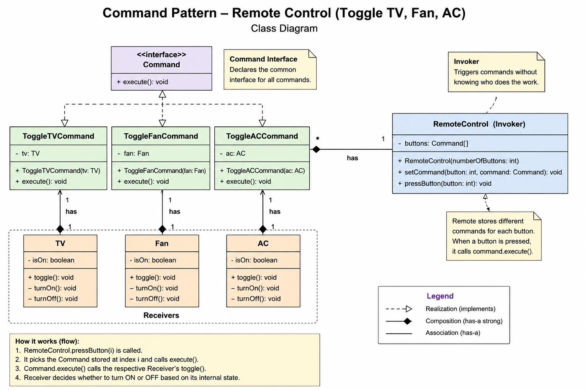

# Command Pattern — Complete LLD Notes

# What is Command Pattern?

Command Pattern is a behavioral design pattern that converts a request into an object.

Instead of directly calling business logic:

```java
tv.turnOn();
```

we wrap the request inside a command object:

```java
Command command = new ToggleTVCommand(tv);
```

Now the request itself becomes an object.

That object can:
- execute later
- be stored
- be queued
- be logged
- support undo/redo

---

# Core Idea

Separate:

```text
REQUEST SENDER
FROM
REQUEST EXECUTOR
```

using a command object.

---

# Main Goal

Decouple:
- who triggers action
  from
- who performs action

---

# Real World Example

Remote Control.

```text
Remote button pressed
      |
      v
Command executes
      |
      v
TV/Fan/AC performs work
```

Remote never knows actual business logic.

---

# Main Components

| Component | Responsibility |
|---|---|
| Command | Common executable abstraction |
| Concrete Command | Wraps request |
| Receiver | Actual business logic |
| Invoker | Triggers command |
| Client | Wires everything |

---

# Component Deep Understanding

---

# 1. Command Interface

```java
public interface Command {
    void execute();
}
```

Represents executable request.

Invoker works with this abstraction only.

---

# 2. Concrete Command

Example:

```java
ToggleTVCommand
```

Responsibilities:
- implements Command
- stores receiver reference
- delegates work to receiver

Example:

```java
tv.toggle();
```

---

# 3. Receiver

Example:

```java
TV
Fan
AC
```

Receiver contains:
- actual business logic
- actual state
- rules

Example:

```java
private boolean isOn;
```

Receiver decides:
- ON/OFF
- business behavior
- internal execution

---

# 4. Invoker

Example:

```java
RemoteControl
```

Invoker responsibility:
- trigger command execution

Invoker should NEVER know:
- TV logic
- Fan logic
- AC logic

Invoker should ONLY do:

```java
command.execute();
```

---

# 5. Client

Client creates and wires everything.

Example:
- creates receivers
- creates commands
- injects receivers into commands
- assigns commands to buttons

---

# Core Runtime Flow

```text
Client
   |
   v
RemoteControl.pressButton()
   |
   v
Command.execute()
   |
   v
Receiver.toggle()
```

---

# Most Important Insight

# Request becomes object

This is ENTIRE Command Pattern.

Because request becomes object:
- queueing possible
- undo possible
- logging possible
- replay possible
- scheduling possible

---

# Relationships

# IS-A Relationship

```text
ToggleTVCommand IS-A Command
```

because:

```java
implements Command
```

---

# HAS-A Relationship

```text
ToggleTVCommand HAS-A TV
```

because:
- command uses TV
- command delegates work to TV

---

# Another HAS-A

```text
RemoteControl HAS-A Command
```

because:
- remote stores commands
- remote executes commands

---

# Why Composition Over Inheritance?

Correct:

```text
Command HAS-A Receiver
```

Wrong:

```text
Command IS-A Receiver
```

Reason:
- command is not TV
- command only USES TV

---

# Practical Example

Remote control with:
- TV
- Fan
- AC

Each button:
- toggles ON/OFF

---

# Why Toggle?

Real remotes use same button for:
- ON
- OFF

Receiver internally manages state.

---

# Receiver Owns State

Example:

```java
private boolean isOn;
```

VERY important design concept.

State belongs to receiver because:
- receiver owns business behavior
- receiver knows current status

Invoker should NOT maintain state.

---

# Correct Responsibility Separation

| Component | Responsibility |
|---|---|
| Remote | trigger |
| Command | encapsulate request |
| Receiver | state + business logic |

---

# Correct Toggle Flow

```text
Remote
   |
   v
ToggleTVCommand.execute()
   |
   v
TV.toggle()
   |
   v
TV decides:
ON or OFF
```

---

# Why Remote Should Not Know State?

Wrong:

```java
if(tv.isOn())
```

inside remote.

Problem:
- tight coupling
- business logic leakage
- SRP violation

Remote should remain generic.

---

# Final Remote Design

```java
private Command[] buttons;
```

Each button stores command object.

Example:

```text
Button 0 -> ToggleTVCommand
Button 1 -> ToggleFanCommand
Button 2 -> ToggleACCommand
```

---

# Runtime Memory Visualization

```text
RemoteControl
      |
      |----> ToggleTVCommand
      |               |
      |               ---> TV
      |
      |----> ToggleFanCommand
      |               |
      |               ---> Fan
      |
      |----> ToggleACCommand
                      |
                      ---> AC
```

---

# Why Command Objects Are Powerful?

Because commands are objects.

Now possible:
- queue commands
- store commands
- log commands
- replay commands
- schedule commands

---

# Queueing Example

```java
Queue<Command>
```

Useful in:
- task scheduler
- async jobs
- background workers

---

# Undo Concept

Command can support:

```java
undo()
```

because command knows:
- receiver
- previous action

---

# Logging Example

```text
TV Toggle Command executed at 10:30 PM
```

Possible because request is object.

---

# Open/Closed Principle

Need new feature?

Example:

```text
ToggleMusicSystemCommand
```

Add new command class.

RemoteControl does NOT change.

This is Open/Closed Principle.

---

# Why We Used Concrete Receivers?

Example:

```java
private TV tv;
```

instead of:

```java
private Appliance appliance;
```

Reason:

TV, Fan, AC may have very different behavior.

Example:

TV:
- changeChannel()
- increaseVolume()

Fan:
- increaseSpeed()

AC:
- setTemperature()

No strong common abstraction.

So concrete receivers are fine.

---

# When Interface Receiver Makes Sense?

If all appliances genuinely support:

```java
turnOn()
turnOff()
toggle()
```

Then:

```java
interface Appliance
```

can be useful.

---

# Important LLD Lesson

Do NOT force abstraction.

Create interfaces only when:
- common behavior genuinely exists.

---

# Golden Rule

Ask:

```text
Can all implementations truly support this behavior?
```

If YES:
- create interface

If NO:
- concrete classes better

---

# Common Mistakes

---

# Mistake 1

Putting business logic inside invoker.

Wrong:

```java
remote.pressButton() {
   tv.toggle();
}
```

---

# Mistake 2

Invoker maintaining receiver state.

Wrong:

```java
if(tv.isOn())
```

---

# Mistake 3

Using inheritance instead of composition.

Wrong:

```text
Command IS-A TV
```

Correct:

```text
Command HAS-A TV
```

---

# Mistake 4

Creating unnecessary interfaces.

Bad abstraction creates bad design.

---

# Interview Questions

---

# Why use Command Pattern?

To decouple sender from executor by encapsulating request as object.

---

# Difference between Invoker and Receiver?

| Invoker | Receiver |
|---|---|
| Triggers action | Performs actual work |
| No business logic | Contains business logic |

---

# Why request as object?

Because requests can:
- queue
- undo
- log
- replay
- schedule

---

# Why is Command Pattern loosely coupled?

Because invoker never knows:
- actual receiver
- business logic
- execution details

Invoker only calls:

```java
command.execute();
```

---

# Final Architecture

```text
                RemoteControl
                       |
          --------------------------------
          |              |              |
          v              v              v
   ToggleTVCommand ToggleFanCommand ToggleACCommand
          |              |              |
          v              v              v
          TV            Fan             AC
```

---

# Biggest Takeaway

Command Pattern separates:

```text
ACTION TRIGGERING
FROM
ACTION EXECUTION
```

using command objects.

That single idea enables:
- loose coupling
- extensibility
- undo/redo
- queueing
- scheduling
- logging
- replay systems

and this is why Command Pattern is one of the most important behavioral design patterns in LLD.

# Class Diagram
