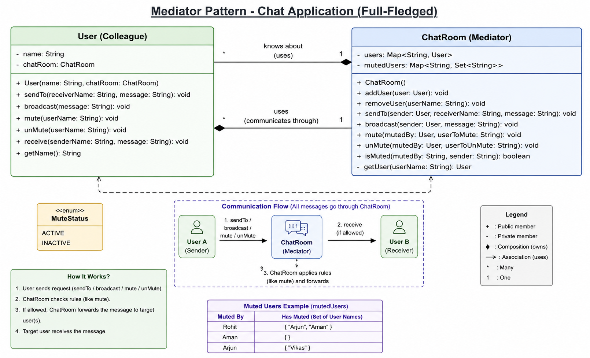

# Mediator Pattern

## What is Mediator Pattern?

Mediator Pattern ek Behavioral Design Pattern hai jo multiple objects ke beech communication ko centralize karta hai.

Normally objects directly ek dusre se baat karte hain:

```text
User A -------> User B
```

Jaise-jaise objects badhte hain, dependencies aur coupling bhi badhne lagti hai.

Mediator Pattern ek central object introduce karta hai jo saari communication coordinate karta hai:

```text
User A
   |
   v
Mediator
   |
   v
User B
```

Ab objects ek dusre ko directly nahi jaante. Sab communication mediator ke through hoti hai.

---

## Why Do We Need It?

Suppose hum Chat Application bana rahe hain.

Agar users directly communicate karenge:

```text
Arjun ----> Rohit
Arjun ----> Aman
Arjun ----> Vikas
Rohit ----> Aman
...
```

Har user ko baaki users ke references rakhne padenge.

Problems:

* High Coupling
* Difficult Maintenance
* Difficult Testing
* Difficult Scalability

Mediator Pattern communication ko centralize karke in problems ko solve karta hai.

---

## Chat Application Example

Humare example me:

```text
Users
-----
Arjun
Rohit
Aman
```

Aur:

```text
ChatRoom
```

Mediator ka role play karega.

Communication flow:

```text
Arjun
   |
   v
ChatRoom
   |
   v
Rohit
```

Instead of:

```text
Arjun --------> Rohit
```

---

## Objects in Our Design

### User (Colleague)

User communication initiate karta hai.

Responsibilities:

* send private message
* broadcast message
* receive message

User dusre users ko directly nahi jaanta.

User sirf ChatRoom ko jaanta hai.

State:

```java
String name;
ChatRoom chatRoom;
```

---

### ChatRoom (Mediator)

ChatRoom communication coordinator hai.

Responsibilities:

* store users
* register users
* find receiver
* route private messages
* broadcast messages
* apply communication rules

State:

```java
Map<String, User> users;
```

Advanced Version:

```java
Map<String, User> users;

Map<String, Set<String>>
mutedUsers;
```

---

## Relationships

### ChatRoom HAS-A Users

```java
Map<String, User> users;
```

Reason:

ChatRoom ko users lookup karne hain.

---

### User HAS-A ChatRoom

```java
ChatRoom chatRoom;
```

Reason:

User ko communication route karni hai.

User directly kisi aur user ko nahi jaanta.

---

## Runtime Flow

### Private Message

Code:

```java
arjun.sendTo(
    "Rohit",
    "Hello Rohit"
);
```

Execution Flow:

```text
Arjun.sendTo()

      |
      v

ChatRoom.sendTo()

      |
      v

users.get("Rohit")

      |
      v

Rohit.receive()
```

Important:

```text
Arjun never calls
Rohit.receive()
```

Mediator hi delivery karta hai.

---

## Broadcast Flow

Code:

```java
arjun.broadcast(
    "Hello Everyone"
);
```

Execution Flow:

```text
Arjun.broadcast()

        |
        v

ChatRoom.broadcast()

        |
        +--> Rohit.receive()

        |
        +--> Aman.receive()
```

ChatRoom decide karta hai kaun message receive karega.

---

## Mute Feature (Advanced Example)

Requirement:

```text
Rohit mutes Arjun
```

ChatRoom state:

```java
Map<String, Set<String>>
mutedUsers;
```

Example:

```text
Rohit -> [Arjun]
Aman  -> []
Arjun -> []
```

Meaning:

```text
Rohit does not want messages
from Arjun.
```

---

## Message Flow With Mute

```java
arjun.sendTo(
    "Rohit",
    "Hello"
);
```

Execution:

```text
Arjun.sendTo()

      |
      v

ChatRoom.sendTo()

      |
      v

Check mute rules

      |
      +--> Muted ?
      |        |
      |        +--> Stop
      |
      v

Deliver Message
```

Mediator controls communication rules.

---

## Why Users Should Not Talk Directly?

Bad Design:

```text
Arjun -------> Rohit
```

Problems:

* Direct dependency
* Tight coupling
* Hard to maintain
* Hard to extend

---

Good Design:

```text
Arjun
   |
   v
ChatRoom
   |
   v
Rohit
```

Benefits:

* Loose coupling
* Centralized control
* Easy maintenance
* Easy extension

---

## Dependency Reduction

Without Mediator:

```text
User knows all users
```

With Mediator:

```text
User knows only ChatRoom
```

This is the biggest benefit of the pattern.

---

## Internal Memory Visualization

After Registration:

```text
ChatRoom
 |
 +--> Arjun
 |
 +--> Rohit
 |
 +--> Aman


Arjun
 |
 +--> ChatRoom


Rohit
 |
 +--> ChatRoom


Aman
 |
 +--> ChatRoom
```

Every user points to the same ChatRoom object.

ChatRoom stores all users.

---

## Pros

* Loose Coupling
* Centralized Communication
* Easy to Maintain
* Easy to Add Rules
* Easy to Extend

---

## Cons

* Mediator can become very large
* Risk of God Object
* All communication logic moves to one place

---

## God Object Problem

Bad Example:

```text
ChatRoom
```

starts handling:

* Messaging
* Payments
* Notifications
* Analytics
* User Management
* File Storage

Now ChatRoom becomes:

```text
God Object
```

which is difficult to maintain.

Mediator should coordinate communication only.

---

## Mediator vs Observer

### Observer

```text
One -> Many Notification
```

Example:

```text
YouTube Channel
      |
      +--> Subscriber 1
      +--> Subscriber 2
      +--> Subscriber 3
```

Publisher doesn't coordinate interactions.

It only notifies.

---

### Mediator

```text
Many -> Many Communication
```

Example:

```text
Arjun
   |
   v
ChatRoom
   |
   v
Rohit
```

Mediator actively coordinates interactions.

---

## Mediator vs Facade

### Facade

Provides simplified access.

```text
Client
   |
   v
Facade
   |
   +--> Subsystem A
   +--> Subsystem B
```

Goal:

```text
Hide complexity
```

---

### Mediator

Coordinates communication.

```text
Object A
   |
   v
Mediator
   |
   v
Object B
```

Goal:

```text
Reduce coupling
```

---

## When NOT To Use Mediator

Do not use Mediator when:

* Only 2 simple objects interact
* Communication is very simple
* Central coordinator adds unnecessary complexity

If direct communication is already simple and maintainable, Mediator is unnecessary.

---

## Interview One-Liner

Mediator Pattern centralizes communication between multiple objects by introducing a mediator object, reducing direct dependencies and coupling between collaborating objects.
# Class Diagram
