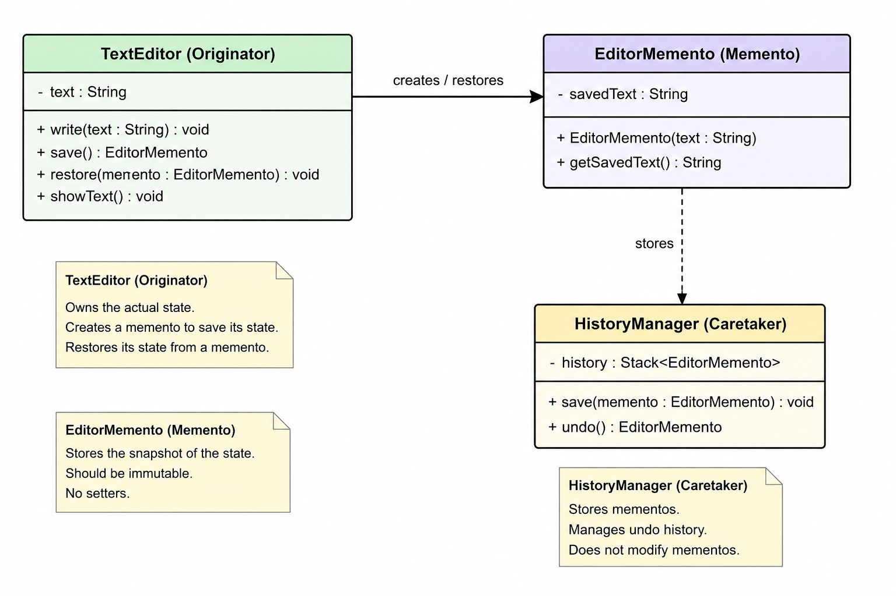

# Memento Pattern — Complete Notes

# What is Memento Pattern?

Memento Pattern is a behavioral design pattern used to save and restore an object's previous state without exposing its internal details.

Simple meaning:

```text
Take a snapshot of object state now,
so that it can be restored later.
```

This pattern is mainly used for:

* Undo systems
* Rollback systems
* Save checkpoints
* History tracking

Examples:

* CTRL + Z in text editor
* Game save checkpoints
* Drawing application undo
* Database rollback

---

# Core Idea

Memento Pattern focuses on:

```text
SAVE → STORE → RESTORE
```

The object creates its own snapshot and later restores itself from that snapshot.

Important point:

```text
Outside classes should NOT directly access internal state.
```

That is why this pattern preserves encapsulation.

---

# Main Problem It Solves

Suppose we have a TextEditor object.

Current text:

```text
Hello World
```

User writes more text:

```text
Hello World Java
```

Now user presses:

```text
CTRL + Z
```

Question:

```text
How will system go back to old state?
```

We need:

* old state storage
* history management
* restoration mechanism

Memento Pattern solves this cleanly.

---

# Why Not Store State Directly Outside?

Without Memento Pattern:

outside classes would need direct access to:

* text
* cursor
* selection
* internal fields

That breaks encapsulation.

Example:

```java
editor.text = oldText;
```

This is bad design because:

* private data gets exposed
* outside classes become tightly coupled
* internal implementation leaks

Memento Pattern avoids this problem.

---

# Main Components

# 1. Originator

The main object whose state changes.

Example:

```text
TextEditor
```

Responsibilities:

* create snapshot
* restore snapshot
* own actual state

Important:

```text
Only Originator knows what should be saved.
```

---

# 2. Memento

Snapshot object.

It stores saved state.

Example:

```text
EditorMemento
```

Responsibilities:

* preserve old state
* keep snapshot safe

Memento should usually be immutable.

Why?

Because old history should never change accidentally.

---

# 3. Caretaker

History manager.

Example:

```text
HistoryManager
```

Responsibilities:

* store snapshots
* manage undo history
* return old snapshots

Important:

```text
Caretaker should NOT modify snapshot data.
```

Caretaker only stores history.

---

# Snapshot Concept

Snapshot means:

```text
Frozen copy of state at one moment.
```

Like:

* photo
* game checkpoint
* saved draft

Important:

```text
Snapshot is NOT live object reference.
```

---

# Snapshot vs Live Object Reference

Wrong approach:

```java
savedEditor = editor;
```

This only stores reference to same object.

Future changes will affect both references.

Undo will fail.

Correct approach:

```java
new EditorMemento(text);
```

This creates separate snapshot object.

Now old state remains safe.

---

# Runtime Flow

Complete flow:

```text
User changes object
      ↓
Originator creates snapshot
      ↓
Caretaker stores snapshot
      ↓
More changes happen
      ↓
Undo requested
      ↓
Caretaker returns snapshot
      ↓
Originator restores old state
```

---

# Undo Flow

Undo system usually uses Stack.

Reason:

```text
Undo follows LIFO behavior
```

Latest change should undo first.

Example history:

```text
TOP
|
| "Hello Java"
| "Hello World"
| "Hello"
|
BOTTOM
```

Undo:

* latest snapshot popped
* old state restored

---

# Why Stack is Used?

Because undo works like:

```text
Last Saved State
First Restored
```

This is exactly Stack behavior.

---

# Why Memento Should Be Immutable?

Suppose snapshot can change.

Then:

```text
Old history can get corrupted.
```

Undo becomes unreliable.

Immutable snapshot ensures:

* history safety
* consistent restoration
* no accidental modification

---

# Why Caretaker Should Not Modify State

Caretaker is only history manager.

Its responsibility:

```text
STORE
RETURN
MANAGE HISTORY
```

NOT:

* edit snapshot
* understand internals
* manipulate state

This keeps responsibilities separated.

---

# Why Originator Creates Memento

Because only Originator knows:

* which fields are important
* which fields should be hidden
* how state should be restored

Outside classes should not know internal implementation.

---

# Encapsulation Preservation

This is the MOST important concept.

Without Memento:

outside classes need access to private fields.

Bad design.

With Memento:

```text
Originator controls its own state.
```

Outside world only handles snapshot objects.

This preserves:

* encapsulation
* loose coupling
* clean design

---

# Internal Ownership Understanding

# Originator

Owns:

* current live state

# Memento

Owns:

* frozen old state

# Caretaker

Owns:

* history storage

---

# HAS-A Relationships

# HistoryManager HAS-A Stack

Because it stores history internally.

# Stack HAS-A Mementos

Because stack stores snapshots.

---

# IS-A Relationships

There is usually no inheritance relationship in basic Memento implementation.

Classes have separate responsibilities.

---

# Shallow Copy vs Deep Copy

Very important in real systems.

Suppose state contains:

```java
List<String> lines;
```

Wrong:

```java
this.lines = originalLines;
```

This stores same reference.

Future modifications affect snapshot too.

Correct:

```java
this.lines = new ArrayList<>(originalLines);
```

This creates separate copy.

---

# Why Large Snapshots Can Be Expensive

Suppose object contains:

* huge lists
* images
* nested objects
* buffers

Every snapshot may require:

* deep copy
* large memory
* expensive operations

Too many snapshots can create memory problems.

That is why production systems often use:

* limited history
* compression
* delta snapshots

---

# Difference Between Memento and Command Pattern

# Command Pattern

Stores:

```text
ACTION
```

Example:

```text
DeleteCommand
InsertCommand
```

Undo means reversing command.

---

# Memento Pattern

Stores:

```text
STATE SNAPSHOT
```

Undo means restoring old state.

---

# Simple Difference

# Command Pattern

```text
How to undo?
```

# Memento Pattern

```text
What was previous state?
```

---

# Difference Between Memento and State Pattern

# State Pattern

Focus:

* changing behavior based on current state

---

# Memento Pattern

Focus:

* restoring previous state

---

# When NOT to Use Memento Pattern

Avoid when:

* object state is huge
* snapshots are expensive
* memory is limited
* state changes very frequently

Examples:

* large video editing systems
* huge game worlds
* massive object graphs

---

# Real-World Examples

# Text Editor Undo

Save text snapshots and restore old text.

# Game Save Checkpoints

Restore old player state.

# Drawing Applications

Undo previous drawing operations.

# Database Rollback

Restore previous transaction state.

---

# Biggest Design Insight

Memento Pattern separates:

```text
STATE OWNERSHIP
FROM
HISTORY MANAGEMENT
```

Originator:

* owns state

Caretaker:

* owns history

Memento:

* safely preserves snapshot

---

# Final Understanding

Memento Pattern is completely focused on:

```text
STATE RESTORATION
```

The main purpose is:

```text
Save current state safely,
store history,
restore exact old state later.
```

Core philosophy:

```text
Originator:
"I know my internal state"

Memento:
"I safely preserve snapshot"

Caretaker:
"I only manage history"
```
# Class Diagram
