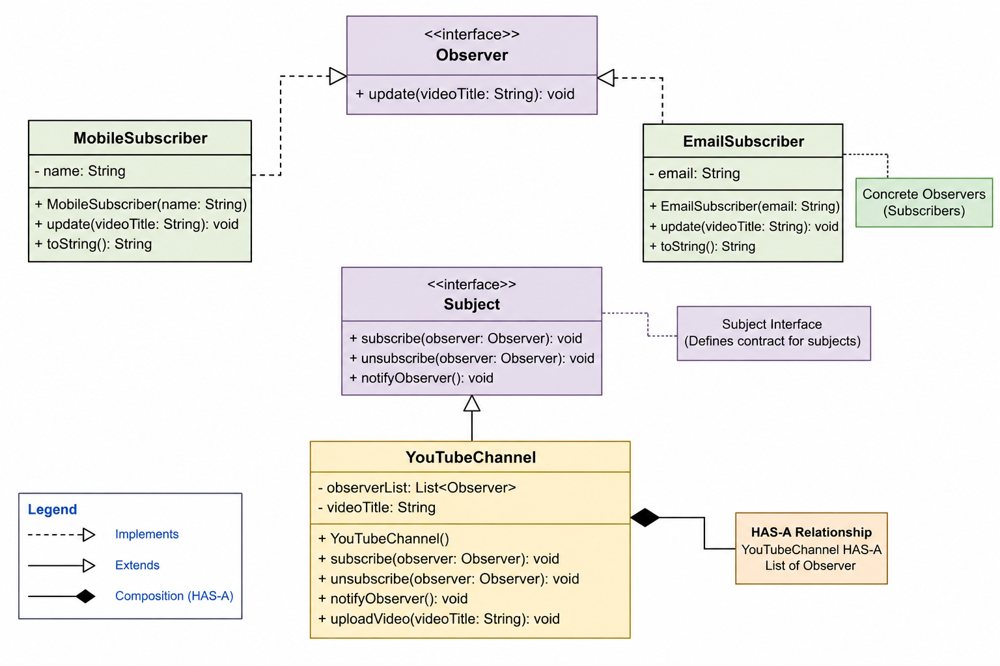

# Observer Pattern - Complete Deep Dive Notes

# What is Observer Pattern?

Observer Pattern is a Behavioral Design Pattern where:

```text
One object changes state
→ multiple dependent objects get notified automatically
```

It creates a:

```text
ONE-TO-MANY relationship
```

between objects.

---

# Real-world Examples

- YouTube subscriptions
- Instagram followers
- Notification systems
- Stock market apps
- Event listeners
- Weather monitoring systems
- Chat applications

---

# Core Idea

```text
Subject broadcasts updates
Observers react to updates
```

Subject does NOT care:
- how observers work internally
- what observers do with updates

It only sends notifications.

---

# Main Goal

To achieve:

```text
Loose Coupling
```

between:
- event producer
- event consumers

---

# Why is it used?

Used when:

```text
One object's state changes
and many other objects need automatic updates.
```

without tightly coupling all classes together.

---

# Problem Without Observer Pattern

Without Observer Pattern:

```java
if(videoUploaded) {
    emailService.send();
    mobileService.send();
    smsService.send();
}
```

Problems:
- tight coupling
- hard to extend
- subject becomes huge
- violates Open/Closed Principle
- difficult maintenance

---

# Solution

Observer Pattern says:

```text
Subject should only know:
"I have observers"
```

NOT:

```text
What type of observers they are
```

This creates flexibility.

---

# Mental Model

Think of:

```text
YouTube Channel
```

Subscribers:
- subscribe
- unsubscribe

Whenever creator uploads video:

```text
All subscribers receive notification automatically
```

The channel does NOT know:
- who exactly subscriber is
- how notification is handled

It only broadcasts updates.

---

# Components of Observer Pattern

# 1. Subject

Represents:

```text
Object being observed
```

Responsibilities:
- register observers
- remove observers
- notify observers

---

# 2. Observer

Represents:

```text
Objects waiting for updates
```

Responsibilities:
- receive notifications
- react to updates

---

# 3. Concrete Subject

Actual implementation of subject.

Example:

```text
YouTubeChannel
```

Responsibilities:
- maintain observer list
- manage state
- notify all observers

---

# 4. Concrete Observers

Actual subscribers.

Examples:
- MobileSubscriber
- EmailSubscriber

Responsibilities:
- implement update behavior

---

# Relationship Understanding

# Subject HAS-A List of Observers

```java
List<Observer> observers;
```

Because:
- subject stores subscribers

---

# Concrete Observer IS-A Observer

```java
class MobileSubscriber implements Observer
```

Because:
- it follows observer behavior

---

# Concrete Subject IS-A Subject

```java
class YouTubeChannel implements Subject
```

Because:
- it follows subject behavior

---

# HAS-A vs IS-A Understanding

# HAS-A

Composition.

Question:

```text
Does object NEED another object to work?
```

Example:

```text
YouTubeChannel HAS-A List<Observer>
```

because channel needs subscribers.

---

# IS-A

Inheritance/interface.

Question:

```text
Can I say:
X IS A Y ?
```

Example:

```text
MobileSubscriber IS-A Observer
```

YES.

So interface implementation is correct.

---

# Why Observer Pattern Supports Loose Coupling

Subject depends only on:

```java
Observer
```

NOT:

```java
MobileSubscriber
EmailSubscriber
```

This means:
- new observer types can be added
- subject code remains unchanged

This is:

```text
Programming to interfaces
```

---

# Dynamic Subscribe/Unsubscribe

Observers can:
- join anytime
- leave anytime

at runtime.

Example:

```java
channel.subscribe(user);
channel.unsubscribe(user);
```

This dynamic behavior is major advantage of Observer Pattern.

---

# Internal Working Flow

# Step 1

Create subject.

```java
YouTubeChannel channel = new YouTubeChannel();
```

Internally:

```text
channel
   |
   ---> observer list
```

---

# Step 2

Create observers.

```java
Observer user1 =
    new MobileSubscriber("Arjun");
```

---

# Step 3

Subscribe observers.

```java
channel.subscribe(user1);
```

Now:

```text
channel
   |
   ---> [user1]
```

---

# Step 4

Upload video.

```java
channel.uploadVideo("Observer Pattern");
```

Internally:
1. video title updated
2. notifyObservers() called

---

# Step 5

Notify all observers.

```java
for(Observer observer : observerList) {
    observer.update(videoTitle);
}
```

Each observer reacts differently.

---

# Full Notification Flow

```text
Client
   |
   v
YouTubeChannel
   |
   | notifyObservers()
   v
+------------------+
| MobileSubscriber |
+------------------+

+------------------+
| EmailSubscriber  |
+------------------+
```

---

# Why Interfaces Exist

# Observer Interface

Represents:

```text
Common notification behavior
```

Allows all observers to be treated uniformly.

Subject can simply call:

```java
observer.update()
```

without knowing actual type.

---

# Subject Interface

Represents:

```text
Anything that supports observers
```

Allows loose coupling and future extensibility.

---

# Why List<Observer> and not List<MobileSubscriber>?

Wrong:

```java
List<MobileSubscriber>
```

Correct:

```java
List<Observer>
```

Because:
- subject should depend on abstraction
- not concrete implementation

This is core design principle.

---

# Why notifyObservers() loops through list?

Because Observer Pattern supports:

```text
Broadcast communication
```

One subject:
→ many observers

---

# Why override toString()?

Default Java toString():

```text
ClassName@memoryAddress
```

Not human-readable.

Custom toString() improves:
- logging
- debugging
- monitoring

Example:

```java
@Override
public String toString() {
    return "MobileSubscriber{name='" + name + "'}";
}
```

---

# Why fields should be private?

Wrong:

```java
public List<Observer> observerList;
```

Correct:

```java
private List<Observer> observerList;
```

Because:
- encapsulation
- protects internal state
- proper OOP design

---

# Advantages

# 1. Loose Coupling

Subject knows only Observer interface.

---

# 2. Dynamic Relationships

Observers can subscribe/unsubscribe anytime.

---

# 3. Easy Extensibility

Add new observer types without changing subject.

Example:
- WhatsAppSubscriber
- PushNotificationSubscriber

---

# 4. Follows Open/Closed Principle

Open for extension.
Closed for modification.

---

# 5. Event-driven Architecture Support

Perfect for:
- notification systems
- listener systems
- reactive systems

---

# Disadvantages

# 1. Hard Debugging

Notification chains become difficult to trace.

---

# 2. Too Many Notifications

Large observer lists may impact performance.

---

# 3. Unpredictable Notification Order

Observers may execute in unexpected order.

---

# 4. Infinite Update Loops Possible

Observers modifying subject again can trigger recursive notifications.

---

# Common Mistakes

# Mistake 1

Depending on concrete observer classes.

Wrong:

```java
List<MobileSubscriber>
```

Correct:

```java
List<Observer>
```

---

# Mistake 2

Forgetting unsubscribe logic.

Can cause:
- memory leaks
- unnecessary notifications

---

# Mistake 3

Putting business logic inside notifyObservers().

notifyObservers() should ONLY broadcast.

---

# Mistake 4

Observer modifying subject repeatedly.

Can create infinite notification cycles.

---

# When NOT to Use Observer Pattern

# 1. Small Simple Systems

If:
- few objects
- fixed relationships

then direct method calls are simpler.

---

# 2. Fixed Dependencies

If dependencies never change:

```text
Service A always calls Service B
```

then Observer Pattern adds unnecessary complexity.

---

# 3. Strict Execution Order Required

Observer execution order may become unpredictable.

For transaction-heavy systems:
- banking
- payment systems

direct orchestration is safer.

---

# 4. Performance-critical Massive Systems

Millions of notifications can become expensive.

Better solutions:
- Kafka
- message queues
- async event systems

---

# 5. Debugging Simplicity More Important

Observer introduces indirect communication.

Simple CRUD systems may not need this complexity.

---

# Biggest Design Insight

Observer Pattern separates:

```text
EVENT PRODUCER
FROM
EVENT CONSUMERS
```

Subject:
- broadcasts events

Observers:
- react independently

This creates:
- flexibility
- extensibility
- loose coupling

---

# Interview Questions

# Q1. What problem does Observer solve?

Automatic notification between loosely coupled objects.

---

# Q2. Why loosely coupled?

Because subject depends only on Observer abstraction.

---

# Q3. Real-world examples?

- YouTube subscriptions
- stock market apps
- event listeners
- notification systems

---

# Q4. Which SOLID principle does it follow?

- Open/Closed Principle
- Dependency Inversion Principle

---

# Q5. Difference between Observer and Pub-Sub?

Observer:
- direct relationship
- usually synchronous

Pub-Sub:
- message broker/event bus
- more decoupled

---

# Complete Working Java Example

# File Structure

```text
observer-pattern/
│
├── observer/
│   ├── Observer.java
│   ├── MobileSubscriber.java
│   └── EmailSubscriber.java
│
├── subject/
│   ├── Subject.java
│   └── YouTubeChannel.java
│
└── Main.java
```

---

# Observer.java

```java
package observer;

public interface Observer {

    void update(String videoTitle);
}
```

---

# MobileSubscriber.java

```java
package observer;

public class MobileSubscriber implements Observer {

    private String name;

    public MobileSubscriber(String name) {
        this.name = name;
    }

    @Override
    public void update(String videoTitle) {

        System.out.println(
            "Mobile Notification to "
            + name
            + ": "
            + videoTitle
        );
    }

    @Override
    public String toString() {
        return "MobileSubscriber{name='"
                + name + "'}";
    }
}
```

---

# EmailSubscriber.java

```java
package observer;

public class EmailSubscriber implements Observer {

    private String email;

    public EmailSubscriber(String email) {
        this.email = email;
    }

    @Override
    public void update(String videoTitle) {

        System.out.println(
            "Email sent to "
            + email
            + ": "
            + videoTitle
        );
    }

    @Override
    public String toString() {
        return "EmailSubscriber{email='"
                + email + "'}";
    }
}
```

---

# Subject.java

```java
package subject;

import observer.Observer;

public interface Subject {

    void subscribe(Observer observer);

    void unsubscribe(Observer observer);

    void notifyObserver();
}
```

---

# YouTubeChannel.java

```java
package subject;

import observer.Observer;

import java.util.ArrayList;
import java.util.List;

public class YouTubeChannel implements Subject {

    private List<Observer> observerList;
    private String videoTitle;

    public YouTubeChannel() {
        this.observerList = new ArrayList<>();
    }

    @Override
    public void subscribe(Observer observer) {

        observerList.add(observer);

        System.out.println(
            "Subscriber added: "
            + observer
        );
    }

    @Override
    public void unsubscribe(Observer observer) {

        observerList.remove(observer);

        System.out.println(
            "Subscriber removed: "
            + observer
        );
    }

    @Override
    public void notifyObserver() {

        for (Observer observer : observerList) {
            observer.update(videoTitle);
        }
    }

    public void uploadVideo(String videoTitle) {

        System.out.println(
            "\nNew Video Uploaded: "
            + videoTitle
        );

        this.videoTitle = videoTitle;

        notifyObserver();
    }
}
```

---

# Main.java

```java
import observer.EmailSubscriber;
import observer.MobileSubscriber;
import observer.Observer;
import subject.YouTubeChannel;

public class Main {

    public static void main(String[] args) {

        YouTubeChannel channel =
                new YouTubeChannel();

        Observer user1 =
                new MobileSubscriber("Arjun");

        Observer user2 =
                new EmailSubscriber(
                        "rahul@gmail.com"
                );

        channel.subscribe(user1);
        channel.subscribe(user2);

        channel.uploadVideo(
                "Observer Pattern Explained"
        );

        channel.unsubscribe(user1);

        System.out.println(
                "\nArjun unsubscribed.\n"
        );

        channel.uploadVideo(
                "Java Multithreading Tutorial"
        );
    }
}
```

---

# Expected Output

```text
Subscriber added: MobileSubscriber{name='Arjun'}

Subscriber added: EmailSubscriber{email='rahul@gmail.com'}

New Video Uploaded: Observer Pattern Explained

Mobile Notification to Arjun:
Observer Pattern Explained

Email sent to rahul@gmail.com:
Observer Pattern Explained


Arjun unsubscribed.


New Video Uploaded: Java Multithreading Tutorial

Email sent to rahul@gmail.com:
Java Multithreading Tutorial
```

---

# UML Class Diagram

```text
                +------------------+
                |    Observer      |
                +------------------+
                | + update()       |
                +------------------+
                         ^
                         |
         ---------------------------------
         |                               |
         |                               |
+--------------------+      +----------------------+
| MobileSubscriber   |      | EmailSubscriber      |
+--------------------+      +----------------------+
| - name             |      | - email              |
+--------------------+      +----------------------+
| + update()         |      | + update()           |
+--------------------+      +----------------------+


                +------------------+
                |     Subject      |
                +------------------+
                | + subscribe()    |
                | + unsubscribe()  |
                | + notifyObserver() |
                +------------------+
                         ^
                         |
                         |
                +----------------------+
                |   YouTubeChannel     |
                +----------------------+
                | - observerList       |
                | - videoTitle         |
                +----------------------+
                | + subscribe()        |
                | + unsubscribe()      |
                | + notifyObserver()   |
                | + uploadVideo()      |
                +----------------------+

YouTubeChannel HAS-A List<Observer>
```

---

# Final Core Understanding

Observer Pattern is basically:

```text
EVENT BROADCASTING SYSTEM
```

where:

```text
One object publishes events
Multiple objects listen and react
```

while staying:

```text
loosely coupled
```
# Class Diagram
