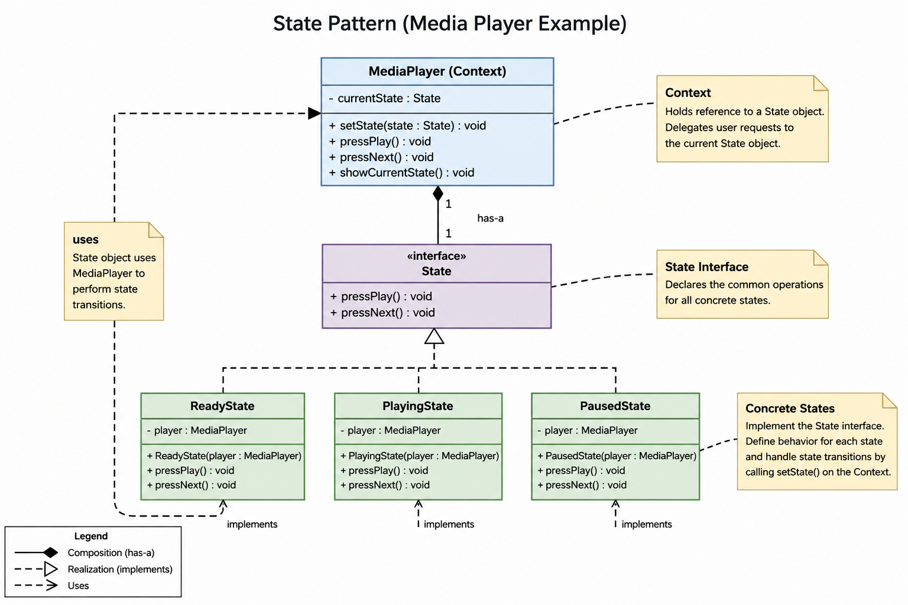

# State Pattern

## What is State Pattern?

State Pattern ek behavioral design pattern hai jisme object apna behavior runtime pe change karta hai based on current internal state.

Simple words me:

```java
same method call
different behavior
depending on current state
```

Example:

| Current State | pressPlay() Behavior |
|---|---|
| READY | Music start |
| PLAYING | Music pause |
| PAUSED | Music resume |

Yani object ka behavior dynamically change hota rehta hai.

---

# Core Idea

State Pattern ka main idea hai:

```java
behavior ko alag-alag state classes me divide kar do
```

Instead of writing giant if-else:

```java
if(state == READY)
else if(state == PLAYING)
else if(state == PAUSED)
```

Hum har state ka separate class bana dete hain.

Example:

```java
ReadyState
PlayingState
PausedState
```

Har state apna:
- behavior
- rules
- transitions

khud handle karti hai.

---

# Main Components

## 1. Context

Hamare example me:

```java
MediaPlayer
```

Ye main object hai jiska behavior change hota hai.

Iske paas hota hai:

```java
private State currentState;
```

Meaning:

```java
MediaPlayer HAS-A State
```

Why?

Because MediaPlayer current state ko use karta hai runtime behavior perform karne ke liye.

---

## 2. State Interface

```java
public interface State {

    void pressPlay();

    void pressNext();
}
```

Ye common contract define karta hai.

MediaPlayer ko ye nahi pata hota actual object:
- ReadyState hai
- PlayingState hai
- PausedState hai

Usko sirf itna pata:

```java
ye koi State object hai
```

Ye runtime polymorphism enable karta hai.

---

## 3. Concrete States

```java
ReadyState
PlayingState
PausedState
```

Each class:

```java
implements State
```

Meaning:

```java
ReadyState IS-A State
PlayingState IS-A State
PausedState IS-A State
```

Har state apna specific behavior handle karti hai.

---

# Most Important Relationships

## Relation 1

```java
MediaPlayer HAS-A State
```

Code:

```java
private State currentState;
```

Why?

Taaki MediaPlayer runtime pe current active state ka method call kar sake.

Example:

```java
currentState.pressPlay();
```

---

## Relation 2

```java
State HAS-A MediaPlayer
```

Code:

```java
private MediaPlayer player;
```

Why?

Taaki state:
- current state change kar sake
- transitions perform kar sake

Example:

```java
player.setState(new PlayingState(player));
```

---

# Bidirectional Relationship

Visualization:

```text
MediaPlayer -----------------> State
      ^                          |
      |                          |
      |                          |
      -------- reference ---------
```

Why needed?

### MediaPlayer ko State chahiye

Taaki:
- current behavior call kar sake

### State ko MediaPlayer chahiye

Taaki:
- currentState change kar sake

---

# Runtime Flow

Initial setup:

```java
MediaPlayer player = new MediaPlayer();

player.setState(new ReadyState(player));
```

Memory:

```text
MediaPlayer
   |
   ---> currentState
              |
              ---> ReadyState object
```

AND

```text
ReadyState
   |
   ---> player reference
              |
              ---> MediaPlayer
```

---

# pressPlay() Internal Flow

User:

```java
player.pressPlay();
```

Flow:

```text
Main
  |
  v
MediaPlayer.pressPlay()
  |
  v
currentState.pressPlay()
```

Agar:

```java
currentState ---> ReadyState
```

Then actual runtime call:

```java
ReadyState.pressPlay()
```

---

# Runtime Polymorphism

Same line:

```java
currentState.pressPlay();
```

Runtime pe different methods call ho sakte hain.

### CASE 1

```java
currentState ---> ReadyState
```

Call:

```java
ReadyState.pressPlay()
```

### CASE 2

```java
currentState ---> PlayingState
```

Call:

```java
PlayingState.pressPlay()
```

### CASE 3

```java
currentState ---> PausedState
```

Call:

```java
PausedState.pressPlay()
```

Same line.

Different behavior.

This is runtime polymorphism.

---

# State Transition Flow

ReadyState ke andar:

```java
public void pressPlay() {

   System.out.println("Starting music");

   player.setState(new PlayingState(player));
}
```

Yaha:

## Step 1

Music start hua.

## Step 2

New state object bana:

```java
new PlayingState(player)
```

## Step 3

State transition hua:

```java
player.setState(...)
```

---

# setState() Internal Working

```java
public void setState(State state) {

    this.currentState = state;
}
```

Old:

```text
currentState ---> ReadyState
```

New:

```text
currentState ---> PlayingState
```

State transition ka matlab sirf:

```java
currentState reference replace hua
```

---

# Why Behavior Changes Dynamically

Behavior change hota hai because:

```java
currentState different object ko point karta rehta hai
```

NOT because:

```java
if-else chal raha hai
```

---

# Delegation Concept

MediaPlayer khud logic nahi likhta.

Wo bas current state ko bolta:

```java
bhai tu handle kar
```

Code:

```java
currentState.pressPlay();
```

Actual behavior state object decide karta hai.

---

# Why State Pattern is Composition Heavy

Because:

```java
MediaPlayer HAS-A State
```

AND

```java
State HAS-A MediaPlayer
```

Objects ek dusre ko use kar rahe hain.

Inheritance nahi.

Composition.

---

# HAS-A vs IS-A

## HAS-A

```java
MediaPlayer HAS-A State
```

Because:
- MediaPlayer state ko use karta hai

---

## IS-A

```java
PlayingState IS-A State
```

Because:

```java
implements State
```

---

# Difference Between State and Strategy Pattern

## Strategy Pattern

Client behavior choose karta hai.

Example:

```java
UPI
Card
PayPal
```

Client decide karta hai kya use karna hai.

---

## State Pattern

Behavior automatically change hota hai based on current internal state.

Example:

```java
READY -> PLAYING -> PAUSED
```

Object khud internally transitions karta rehta hai.

---

# Advantages

- giant if-else remove ho jata hai
- behavior encapsulate ho jata hai
- clean code
- scalable design
- Open/Closed Principle friendly
- runtime behavior switching easy ho jata hai

---

# Disadvantages

- bohot saari classes ban sakti hain
- small projects me overkill ho sakta hai
- transitions debugging difficult ho sakti hai

---

# When NOT to Use

State Pattern mat use karo agar:
- sirf 1-2 conditions hain
- behavior rarely change hota hai
- simple if-else hi kaafi hai

---

# Final Mental Model

```java
Context = Delegator

State Classes = Behavior Specialists
```

MediaPlayer bas current state ko forward karta hai.

Actual kaam:
- state object karta hai
- transitions state object karta hai
- behavior state object decide karta hai

---

# Most Important Takeaway

State Pattern ka pura magic:

```java
currentState reference changing
```

ki wajah se hota hai.

Same line:

```java
currentState.pressPlay();
```

different runtime behavior deti hai because currentState different objects ko point karta rehta hai.

# Class Diagram
