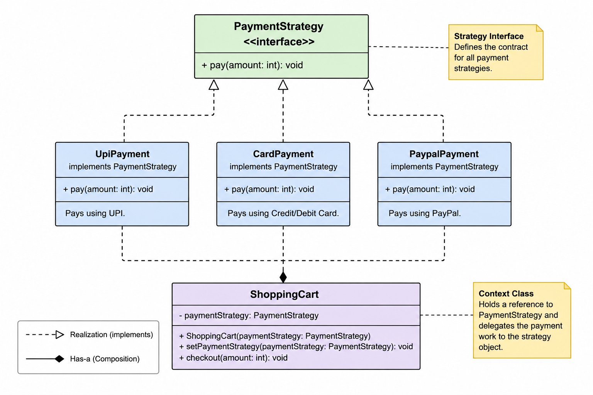

# Strategy Pattern - Deep Dive (LLD)

# What is Strategy Pattern?

Strategy Pattern is a behavioral design pattern where:

- Multiple algorithms/behaviors are encapsulated into separate classes
- These behaviors become interchangeable
- A context object delegates work to a selected strategy object at runtime

Instead of writing large if-else chains, we move each behavior into its own class.

---

# Core Idea

```text
Encapsulate interchangeable behaviors
and switch them dynamically at runtime.
```

---

# Why is Strategy Pattern Used?

It is used when:

- Multiple ways of doing the same task exist
- Behavior may change dynamically at runtime
- Large if-else chains are growing
- We want cleaner and maintainable code
- We want composition over inheritance

---

# What Problem Does It Solve?

Without Strategy Pattern:

```java
if(type.equals("UPI")) {
    // upi logic
}
else if(type.equals("CARD")) {
    // card logic
}
else if(type.equals("PAYPAL")) {
    // paypal logic
}
```

Problems:

- Huge conditional logic
- Difficult to maintain
- Difficult to extend
- Violates Open/Closed Principle
- One class becomes too large

Strategy Pattern solves this by:

```text
Separating each behavior into independent strategy classes.
```

---

# Mental Model / Intuition

Think about Google Maps.

You can choose:

- Car route
- Bike route
- Walking route

Google Maps itself does not contain all routing logic directly.

Instead:

```text
Maps delegates route calculation
to selected route strategy.
```

At runtime:

```text
Car -> Walking
```

Behavior changes dynamically without changing the main object.

This is Strategy Pattern.

---

# Main Components

## 1. Strategy Interface

Defines common behavior contract.

Example:

```java
PaymentStrategy
```

Contains:

```java
pay(int amount)
```

---

## 2. Concrete Strategies

Different implementations of the strategy.

Examples:

```text
UpiPayment
CardPayment
PaypalPayment
```

Each contains its own payment algorithm.

---

## 3. Context Class

Main class that USES strategy.

Example:

```java
ShoppingCart
```

Responsibilities:

- Stores strategy reference
- Delegates behavior to strategy
- Can switch strategy dynamically

---

# Relationships

# IS-A Relationship

```text
UpiPayment IS-A PaymentStrategy
CardPayment IS-A PaymentStrategy
PaypalPayment IS-A PaymentStrategy
```

Because they implement payment behavior.

---

# HAS-A Relationship

```text
ShoppingCart HAS-A PaymentStrategy
```

Because cart USES strategy object.

This is composition.

---

# Why HAS-A instead of IS-A?

Question:

```text
Is ShoppingCart a PaymentStrategy?
```

NO.

But:

```text
ShoppingCart USES PaymentStrategy
```

So:

```text
HAS-A relationship
```

---

# Strategy Pattern Focuses Heavily on Composition

```text
Context object stores strategy object
instead of inheriting behavior.
```

This gives runtime flexibility.

---

# Runtime Behavior Switching

This is the MOST important feature.

Example:

```java
cart.setPaymentStrategy(new CardPayment());
```

Behavior changes immediately at runtime.

Same object.

Different behavior.

---

# Internal Working Flow

# Step 1

Client creates strategy.

```java
PaymentStrategy strategy =
    new UpiPayment();
```

---

# Step 2

Strategy injected into context.

```java
ShoppingCart cart =
    new ShoppingCart(strategy);
```

Now:

```text
ShoppingCart HAS-A UpiPayment
```

---

# Step 3

Client calls checkout.

```java
cart.checkout(5000);
```

Internally:

```java
paymentStrategy.pay(amount);
```

Context delegates behavior.

---

# Step 4

Runtime switching.

```java
cart.setPaymentStrategy(
    new CardPayment()
);
```

Now behavior changes dynamically.

---

# Delegation

Important line:

```java
paymentStrategy.pay(amount);
```

Meaning:

```text
Context delegates responsibility
to strategy object.
```

Delegation is the heart of Strategy Pattern.

---

# Why Strategy Pattern Removes if-else Chains

Without Strategy Pattern:

```java
if(type.equals("UPI"))
else if(type.equals("CARD"))
else if(type.equals("PAYPAL"))
```

Every new behavior modifies old code.

With Strategy Pattern:

```text
Add new strategy class only.
```

Example:

```java
class CryptoPayment
    implements PaymentStrategy
```

No modification in ShoppingCart.

---

# Open/Closed Principle

Strategy Pattern follows:

```text
OPEN for extension
CLOSED for modification
```

Meaning:

- Add new strategies easily
- Existing code remains untouched

---

# Why Composition Over Inheritance?

Inheritance:

```text
Fixed behavior at compile time
```

Composition:

```text
Flexible behavior at runtime
```

Strategy Pattern prefers composition because behaviors can change dynamically.

---

# Pros

- Removes large if-else chains
- Runtime behavior switching
- Better maintainability
- Better scalability
- Better testing
- Follows Open/Closed Principle
- Supports composition over inheritance

---

# Cons

- More classes
- Slightly higher complexity
- Client must choose strategy
- Can feel overengineered for tiny logic

---

# Common Mistakes

## 1. Putting if-else inside strategies

Wrong:

```java
if(...)
```

Each strategy should contain only ONE behavior.

---

## 2. Context knowing concrete strategy details

Wrong:

```java
if(strategy instanceof UpiPayment)
```

Context should treat all strategies uniformly.

---

## 3. Using inheritance instead of composition

Wrong thinking:

```text
ShoppingCart IS-A UpiPayment
```

Correct:

```text
ShoppingCart HAS-A PaymentStrategy
```

---

## 4. Strategies not being interchangeable

All strategies must follow same contract.

---

# Interview Notes

## Why use Strategy Pattern?

```text
To encapsulate interchangeable behaviors
and remove large conditional logic.
```

---

## Why composition over inheritance?

```text
Composition allows runtime flexibility.
Inheritance creates tightly coupled fixed behavior.
```

---

## How does Strategy Pattern follow OCP?

```text
New strategies can be added
without modifying existing code.
```

---

## Difference Between Strategy and State Pattern

# Strategy

- Client chooses behavior

# State

- Object changes behavior internally based on state

---

# Complete Java Example

# File Structure

```text
strategy-pattern/
│
├── strategy/
│   ├── PaymentStrategy.java
│   ├── UpiPayment.java
│   ├── CardPayment.java
│   └── PaypalPayment.java
│
├── context/
│   └── ShoppingCart.java
│
└── Main.java
```

---

# PaymentStrategy.java

```java
package strategy;

public interface PaymentStrategy {

    void pay(int amount);
}
```

---

# UpiPayment.java

```java
package strategy;

public class UpiPayment
        implements PaymentStrategy {

    @Override
    public void pay(int amount) {

        System.out.println(
            "Paid ₹" + amount +
            " using UPI"
        );
    }
}
```

---

# CardPayment.java

```java
package strategy;

public class CardPayment
        implements PaymentStrategy {

    @Override
    public void pay(int amount) {

        System.out.println(
            "Paid ₹" + amount +
            " using Card"
        );
    }
}
```

---

# PaypalPayment.java

```java
package strategy;

public class PaypalPayment
        implements PaymentStrategy {

    @Override
    public void pay(int amount) {

        System.out.println(
            "Paid ₹" + amount +
            " using PayPal"
        );
    }
}
```

---

# ShoppingCart.java

```java
package context;

import strategy.PaymentStrategy;

public class ShoppingCart {

    private PaymentStrategy paymentStrategy;

    public ShoppingCart(
            PaymentStrategy paymentStrategy) {

        this.paymentStrategy =
            paymentStrategy;
    }

    public void setPaymentStrategy(
            PaymentStrategy paymentStrategy) {

        this.paymentStrategy =
            paymentStrategy;
    }

    public void checkout(int amount) {

        paymentStrategy.pay(amount);
    }
}
```

---

# Main.java

```java
import context.ShoppingCart;
import strategy.CardPayment;
import strategy.PaypalPayment;
import strategy.UpiPayment;

public class Main {

    public static void main(String[] args) {

        ShoppingCart cart =
            new ShoppingCart(
                new UpiPayment()
            );

        cart.checkout(5000);

        cart.setPaymentStrategy(
            new CardPayment()
        );

        cart.checkout(10000);

        cart.setPaymentStrategy(
            new PaypalPayment()
        );

        cart.checkout(15000);
    }
}
```

---

# Output

```text
Paid ₹5000 using UPI
Paid ₹10000 using Card
Paid ₹15000 using PayPal
```

---

# UML Class Diagram

```text
                +----------------------+
                |   PaymentStrategy    |
                +----------------------+
                | + pay(amount)        |
                +----------^-----------+
                           |
        -----------------------------------------
        |                  |                    |
        |                  |                    |
+----------------+ +----------------+ +----------------+
|  UpiPayment    | |  CardPayment   | | PaypalPayment  |
+----------------+ +----------------+ +----------------+
| + pay()        | | + pay()        | | + pay()        |
+----------------+ +----------------+ +----------------+

                 HAS-A Relationship
                           |
                           v

                +----------------------+
                |    ShoppingCart      |
                +----------------------+
                | - paymentStrategy    |
                +----------------------+
                | + setPaymentStrategy |
                | + checkout()         |
                +----------------------+
```

---

# Final Mental Model

```text
Context object DOES NOT perform
behavior itself.

It delegates behavior
to interchangeable strategy objects.
```

---

# One-Line Definition

```text
Strategy Pattern encapsulates interchangeable behaviors
into separate classes and delegates execution dynamically at runtime.
```
---
# Class Diagam
