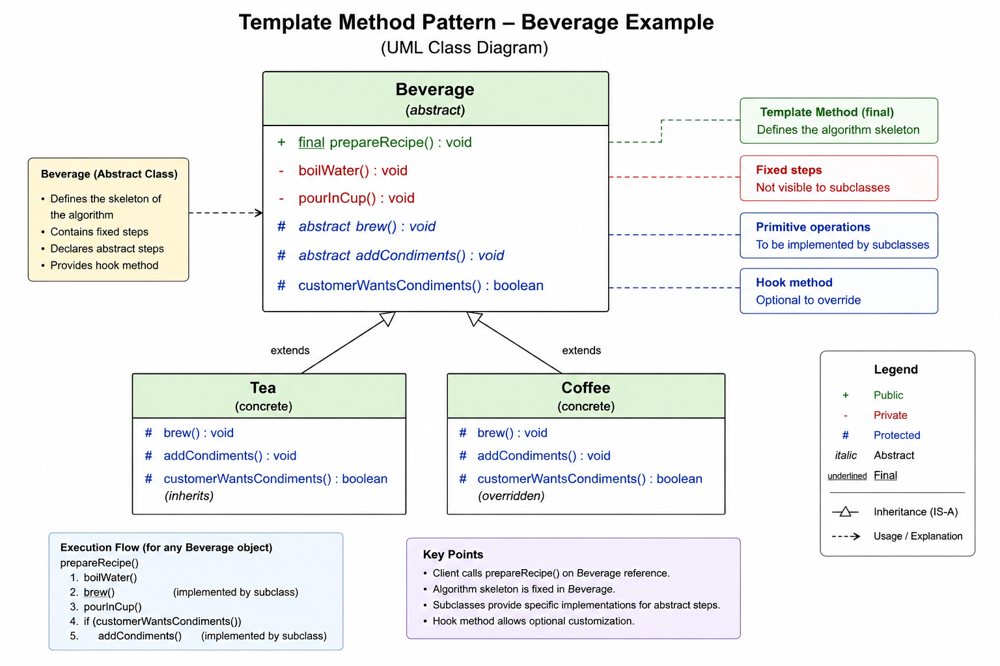

# Template Method Pattern

## Definition

Template Method Pattern defines the skeleton of an algorithm in a parent class while allowing subclasses to customize specific steps without changing the overall workflow.

It is an inheritance-based behavioral design pattern.

---

# Core Idea

Parent class controls:
- algorithm flow
- execution order
- reusable common steps

Subclasses customize:
- variable behavior only

The parent says:

```text
"This is the fixed process.
You are only allowed to customize certain steps."
```

---

# Real World Analogy

## Beverage Preparation

Making tea and coffee both follow:

1. Boil water
2. Brew
3. Pour into cup
4. Add condiments

Overall process remains fixed.

Only some steps differ:
- Tea steeps tea leaves
- Coffee brews coffee beans

This is Template Method Pattern.

---

# Why Use Template Method Pattern?

Without this pattern:
- subclasses duplicate entire algorithms
- workflow becomes inconsistent
- common logic repeats everywhere
- maintenance becomes difficult

Template Method solves this by:
- centralizing workflow
- reusing common logic
- enforcing fixed execution sequence
- allowing controlled customization

---

# Mental Model

Think of a recipe book.

Recipe defines:
1. Preheat oven
2. Prepare ingredients
3. Bake
4. Serve

Chefs can customize:
- ingredients
- spices

But cannot:
- skip baking
- change order randomly

Parent class behaves like recipe book.

Subclasses behave like chefs.

---

# Key Design Insight

Template Method separates:

```text
FIXED PROCESS STRUCTURE
FROM
CUSTOMIZABLE IMPLEMENTATION DETAILS
```

---

# Structure

## Abstract Parent Class

```java
abstract class Beverage
```

Responsibilities:
- owns algorithm
- controls execution order
- provides reusable methods
- defines extension points

---

## Concrete Subclasses

```java
class Tea extends Beverage
class Coffee extends Beverage
```

Responsibilities:
- implement varying behavior
- customize specific steps
- optionally override hooks

---

# Relationships

## IS-A Relationship

```text
Tea IS-A Beverage
Coffee IS-A Beverage
```

Because:
- Tea follows beverage preparation workflow
- Coffee follows beverage preparation workflow

Inheritance is correct here.

---

# HAS-A vs IS-A

Template Method mainly focuses on:

```text
Inheritance
```

Unlike:
- Strategy Pattern
- Command Pattern

which heavily use composition.

Why?

Because subclasses inherit:
- workflow
- reusable logic
- lifecycle control

Parent class directly controls subclass execution.

---

# Template Method

## Definition

A method in parent class that defines the fixed algorithm flow.

Example:

```java
public final void prepareRecipe()
```

This method:
- defines execution sequence
- calls fixed steps
- calls customizable steps

---

# Why Template Method is Usually `final`

To prevent subclasses from changing algorithm flow.

Bad example:

```java
@Override
public void prepareRecipe() {
    addCondiments();
    boilWater();
}
```

This breaks workflow consistency.

So parent protects algorithm using:

```java
final
```

---

# Hollywood Principle

Most important concept.

```text
"Don't call us, we'll call you."
```

Meaning:
- subclass does NOT control flow
- parent controls execution
- parent calls subclass methods internally

This is inversion of control.

---

# Inversion of Control

Normally child decides what to execute.

In Template Method:
- parent decides sequence
- child only provides implementations

Example:

```java
prepareRecipe()
```

inside parent internally calls:

```java
brew()
addCondiments()
```

implemented by subclasses.

---

# Abstract Methods

## Definition

Methods with no implementation in parent class.

Example:

```java
protected abstract void brew();
protected abstract void addCondiments();
```

Why abstract?
Because behavior varies between subclasses.

Tea:
- steeps tea leaves

Coffee:
- brews coffee

Parent knows:
- these steps differ
- subclasses must implement them

---

# Concrete Methods

## Definition

Methods fully implemented in parent class.

Example:

```java
private void boilWater()
private void pourInCup()
```

Why concrete?
Because:
- same for all beverages
- no customization needed

---

# Hook Methods

## Definition

Optional extension points.

Example:

```java
protected boolean customerWantsCondiments() {
    return true;
}
```

Subclass MAY override this.

---

# Why Hook Methods Exist

Sometimes:
- algorithm mostly same
- small optional customization needed

Hooks provide:
- flexibility
- controlled customization
- optional behavior changes

without changing core algorithm.

---

# Example Hook Override

```java
@Override
protected boolean customerWantsCondiments() {
    return false;
}
```

Now condiments step gets skipped.

---

# Runtime Polymorphism

Template Method heavily depends on runtime polymorphism.

Example:

```java
Beverage beverage = new Tea();
beverage.prepareRecipe();
```

Flow:
- prepareRecipe() executes from parent
- brew() executes from Tea dynamically

This dynamic dispatch is runtime polymorphism.

---

# Internal Runtime Flow

## Tea Execution

```java
tea.prepareRecipe();
```

Flow:

```text
prepareRecipe()
    |
    ├── boilWater()
    |
    ├── Tea.brew()
    |
    ├── pourInCup()
    |
    └── Tea.addCondiments()
```

---

## Coffee Execution

```java
coffee.prepareRecipe();
```

Flow:

```text
prepareRecipe()
    |
    ├── boilWater()
    |
    ├── Coffee.brew()
    |
    ├── pourInCup()
    |
    ├── customerWantsCondiments()
    |       |
    |       └── false
    |
    └── addCondiments() skipped
```

---

# Why Access Modifiers Matter

Template Method carefully controls:
- what subclasses can customize
- what they cannot touch

---

# `public`

Example:

```java
public final void prepareRecipe()
```

Reason:
- client should start algorithm
- entry point of workflow

---

# `private`

Example:

```java
private void boilWater()
```

Reason:
- fixed internal behavior
- subclasses should not override
- protects workflow consistency

---

# `protected`

Example:

```java
protected abstract void brew()
```

Reason:
- subclasses must customize
- outside world should not call directly

---

# Biggest Insight About Access Modifiers

```text
public
    = algorithm entry point

private
    = fixed internal implementation

protected
    = subclass extension point
```

---

# Why Abstract Class Exists

Example:

```java
public abstract class Beverage
```

Why abstract?
Because:
- parent class is incomplete
- some steps are missing
- subclasses must complete behavior

You cannot do:

```java
new Beverage();
```

because Beverage itself is incomplete.

---

# Why Parent Class Owns Algorithm

This is the heart of Template Method.

Parent class protects:
- business rules
- execution order
- workflow consistency

Subclasses should customize behavior,
NOT redefine process itself.

---

# Pros

## Strong Code Reuse

Common logic reused in parent.

---

## Fixed Workflow

Subclasses cannot break algorithm sequence.

---

## Cleaner Architecture

Common and varying behavior clearly separated.

---

## Easier Maintenance

Algorithm changes happen centrally.

---

# Cons

## Tight Coupling Through Inheritance

Subclasses depend heavily on parent.

---

## Harder to Modify Core Algorithm

Changing parent affects all subclasses.

---

## Deep Inheritance Can Become Complex

Too many subclasses become difficult to manage.

---

## Slight Open/Closed Principle Violation

Sometimes modifying algorithm requires editing parent class.

---

# Common Mistakes

## Making Everything Abstract

Then parent provides no reusable value.

---

## Allowing Template Method Override

Dangerous because subclasses can break workflow.

Always prefer:

```java
final
```

for template methods.

---

## Too Many Hook Methods

Makes flow unpredictable.

---

## Using Template Method When Strategy is Better

Sometimes composition is cleaner than inheritance.

---

# Strategy vs Template Method

## Template Method

Uses:
- inheritance

Behavior changes through:
- subclassing

Algorithm structure:
- fixed

---

## Strategy

Uses:
- composition

Behavior changes through:
- interchangeable objects

Algorithm itself:
- replaceable dynamically

---

# Prefer Template Method When

- workflow is fixed
- only few steps vary
- strong process control needed

Examples:
- beverage preparation
- report generation
- payment processing pipeline
- game turn systems

---

# Prefer Strategy When

- behaviors change dynamically
- runtime swapping required
- avoiding inheritance hierarchy

---

# Interview Questions

## What is Template Method Pattern?

Defines fixed algorithm structure in parent class while allowing subclasses to customize specific steps.

---

## Why is parent class abstract?

Because:
- some methods are incomplete
- subclasses must implement varying behavior

---

## Why template method is final?

To protect workflow consistency.

---

## What principle does it use?

- inheritance
- runtime polymorphism
- inversion of control
- Hollywood Principle

---

## Difference between Strategy and Template Method?

Template Method:
- inheritance-based
- fixed algorithm structure

Strategy:
- composition-based
- interchangeable algorithms

---

# Complete Java Example

## File Structure

```text
template-method-pattern/
│
├── Beverage.java
├── Tea.java
├── Coffee.java
└── Main.java
```

---

# Beverage.java

```java
public abstract class Beverage {

    // TEMPLATE METHOD
    public final void prepareRecipe() {

        boilWater();

        brew();

        pourInCup();

        if (customerWantsCondiments()) {
            addCondiments();
        }
    }

    // Fixed step
    private void boilWater() {
        System.out.println("Boiling water");
    }

    // Fixed step
    private void pourInCup() {
        System.out.println("Pouring into cup");
    }

    // Variable step
    protected abstract void brew();

    // Variable step
    protected abstract void addCondiments();

    // Hook method
    protected boolean customerWantsCondiments() {
        return true;
    }
}
```

---

# Tea.java

```java
public class Tea extends Beverage {

    @Override
    protected void brew() {
        System.out.println("Steeping tea leaves");
    }

    @Override
    protected void addCondiments() {
        System.out.println("Adding lemon");
    }
}
```

---

# Coffee.java

```java
public class Coffee extends Beverage {

    @Override
    protected void brew() {
        System.out.println("Brewing coffee");
    }

    @Override
    protected void addCondiments() {
        System.out.println("Adding sugar and milk");
    }

    @Override
    protected boolean customerWantsCondiments() {
        return false;
    }
}
```

---

# Main.java

```java
public class Main {

    public static void main(String[] args) {

        Beverage tea = new Tea();

        System.out.println("---- Tea ----");
        tea.prepareRecipe();

        System.out.println();

        Beverage coffee = new Coffee();

        System.out.println("---- Coffee ----");
        coffee.prepareRecipe();
    }
}
```

---

# Output

```text
---- Tea ----
Boiling water
Steeping tea leaves
Pouring into cup
Adding lemon

---- Coffee ----
Boiling water
Brewing coffee
Pouring into cup
```

---

# UML Mental Model

```text
                Beverage
                   ▲
        ---------------------
        |                   |
       Tea               Coffee
```

Parent:
- controls workflow

Children:
- customize behavior

---

# Biggest Takeaway

Template Method Pattern is about:

```text
Parent controls PROCESS,
subclass customizes STEPS.
```

OR

```text
FIXED WORKFLOW
+
CUSTOMIZABLE IMPLEMENTATION
```

That is the entire pattern.

# Class Diagram
