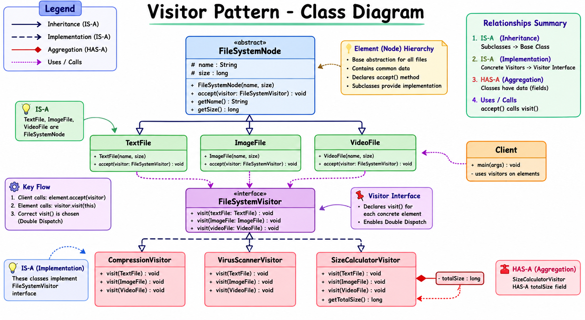

# Visitor Pattern Deep Dive Notes

# What is Visitor Pattern?

Visitor Pattern is a behavioral design pattern where:

* objects keep their structure/data
* external visitor objects perform operations on them

In simple words:

```text
Objects say:
"You can visit me"

Visitors say:
"I know what operation to perform on each object type"
```

The main goal of Visitor Pattern is:

```text
Adding new behaviors without modifying existing classes
```

---

# Core Intuition

Suppose we have:

```text
TextFile
ImageFile
VideoFile
```

Now different operations are needed:

* compression
* virus scanning
* size calculation
* encryption
* metadata export

One option is:
put all these methods inside every file class.

Problem:
those classes become huge and messy.

Instead:
we move operations outside into separate visitor classes.

So:

* file classes stay clean
* operations stay separated
* new behaviors become easy to add

---

# Main Idea of Visitor Pattern

Visitor Pattern separates:

```text
DATA STRUCTURE
from
OPERATIONS / BEHAVIORS
```

Elements represent:

```text
what the object IS
```

Visitors represent:

```text
what we want to DO with the object
```

---

# Real Mental Model

Think about a hospital.

Patients are:

* ChildPatient
* AdultPatient
* SeniorPatient

Doctors are visitors:

* Dentist
* EyeSpecialist
* HeartSpecialist

Each doctor performs different operations depending on patient type.

Patient accepts doctor:

```text
doctor.visit(this)
```

Exactly same thing happens in Visitor Pattern.

---

# Production-Style Architecture

```text
element package
---------------
Actual business objects

visitor package
---------------
External operations

client package
---------------
Application flow / orchestration
```

This separation improves:

* maintainability
* scalability
* readability
* modularity

---

# Element Classes

Elements are actual objects being visited.

Example:

* TextFile
* ImageFile
* VideoFile

These classes mainly contain:

* data
* structure
* identity

They should NOT contain:

* compression logic
* scanning logic
* export logic
* analytics logic

Because those behaviors may grow endlessly.

---

# Why Abstract Base Class Used?

We used:

```text
FileSystemNode
```

because all file types share:

* name
* size
* common contract

This avoids code duplication.

It also provides:

* common abstraction
* runtime polymorphism
* parent references

---

# Visitor Interface

Visitor interface defines:

```text
What operations are supported
```

Example:

```text
visit(TextFile)
visit(ImageFile)
visit(VideoFile)
```

Each file type gets its own overloaded visit method.

This is extremely important for double dispatch.

---

# Concrete Visitors

Concrete visitors contain actual business logic.

Example:

* CompressionVisitor
* VirusScannerVisitor
* SizeCalculatorVisitor

Each visitor focuses on ONE responsibility.

This follows:

* Single Responsibility Principle
* clean separation of concerns

---

# Why Visitor Pattern is Powerful

Suppose tomorrow we need:

* EncryptionVisitor
* BackupVisitor
* AIClassificationVisitor
* LoggingVisitor

We can add them WITHOUT touching:

* TextFile
* ImageFile
* VideoFile

This is the biggest strength of Visitor Pattern.

---

# Open Closed Principle

Visitor Pattern strongly supports:

```text
Open for extension
Closed for modification
```

Meaning:

* new operations can be added
* existing element classes remain unchanged

This is very valuable in enterprise systems.

---

# accept() Method

Every element contains:

```text
accept(visitor)
```

Purpose:

```text
Allow visitor to enter the object
```

Element basically says:

```text
"I will give myself to the visitor"
```

Inside accept():

```text
visitor.visit(this)
```

This line is the heart of Visitor Pattern.

---

# Why "this" is Important

Inside:

```text
visitor.visit(this)
```

the keyword:

```text
this
```

means:

```text
current concrete object
```

Example:
inside TextFile:

```text
this = TextFile object
```

inside ImageFile:

```text
this = ImageFile object
```

This exact concrete type is what enables proper visit method selection.

---

# Runtime Polymorphism in Visitor Pattern

Suppose:

```text
FileSystemNode file = new TextFile(...)
```

Reference type:

```text
FileSystemNode
```

Actual object:

```text
TextFile
```

When:

```text
file.accept(visitor)
```

runs, JVM checks:

```text
actual object type
```

So:

```text
TextFile.accept()
```

executes.

This is runtime polymorphism.

---

# Why Java is Normally Single Dispatch

In normal Java polymorphism:

```text
object.method()
```

runtime decision depends ONLY on:

```text
receiver object type
```

Arguments do not participate in runtime method selection.

That is why Java is called:

```text
single dispatch language
```

---

# Method Overriding vs Overloading

Very important distinction.

## Overriding

Resolved at:

```text
runtime
```

Based on:

```text
actual object type
```

Example:

```text
TextFile.accept()
```

---

## Overloading

Resolved at:

```text
compile time
```

Based on:

```text
reference type / parameter type
```

Example:

```text
visit(TextFile)
visit(ImageFile)
```

---

# How Visitor Pattern Simulates Double Dispatch

Visitor Pattern combines:

* overriding
* overloading

to simulate:

```text
double dispatch
```

---

# Dispatch #1

```text
file.accept(visitor)
```

JVM selects:

```text
which accept() method runs
```

based on:

```text
actual file object type
```

Example:

```text
TextFile.accept()
```

---

# Dispatch #2

Inside accept():

```text
visitor.visit(this)
```

Compiler sees:

```text
this = TextFile
```

So it selects:

```text
visit(TextFile)
```

Then runtime polymorphism selects:

```text
CompressionVisitor.visit(TextFile)
```

This collaboration creates double dispatch behavior.

---

# Double Dispatch Meaning

Normal polymorphism:

```text
only ONE object decides method selection
```

Visitor Pattern:

```text
TWO objects participate
```

1. Element object
2. Visitor object

Both collaborate to determine final behavior.

That is why it is called:

```text
double dispatch
```

---

# Why Overloaded visit() Methods Exist

Each file type needs specialized behavior.

Compression logic for:

* text
* image
* video

may differ completely.

Separate overloaded methods allow:

* type-specific behavior
* clean design
* no instanceof chains

---

# Why Visitor Pattern Avoids instanceof

Without Visitor Pattern:

```text
if(file instanceof TextFile)
else if(file instanceof ImageFile)
else if(file instanceof VideoFile)
```

Problems:

* huge conditional chains
* poor scalability
* violation of Open Closed Principle
* centralized messy logic

Visitor distributes behavior cleanly.

---

# Behavior Extension Focused Design

Visitor Pattern is optimized for situations where:

```text
Object structure remains stable
```

but:

```text
Operations keep growing
```

Example:
file types may remain same for years,
but operations may constantly increase.

Perfect use case for Visitor Pattern.

---

# Why New Visitors are Easy to Add

Adding new visitor means:

```text
just create new class
```

No need to modify:

* TextFile
* ImageFile
* VideoFile

This keeps existing code safe and stable.

Very useful in large enterprise systems.

---

# Why New Element Types are Difficult

Suppose new type added:

```text
AudioFile
```

Now EVERY visitor must update:

```text
visit(AudioFile)
```

inside:

* CompressionVisitor
* VirusScannerVisitor
* SizeCalculatorVisitor
* all visitors

So Visitor Pattern is weak when:

```text
element hierarchy changes frequently
```

---

# Best Use Case of Visitor Pattern

Use Visitor Pattern when:

```text
Object hierarchy is stable
```

and:

```text
new operations are added frequently
```

---

# IS-A Relationships

Examples:

```text
TextFile IS-A FileSystemNode
ImageFile IS-A FileSystemNode
VideoFile IS-A FileSystemNode
```

and:

```text
CompressionVisitor IS-A FileSystemVisitor
VirusScannerVisitor IS-A FileSystemVisitor
```

This enables:

* abstraction
* runtime polymorphism
* parent references

---

# HAS-A Relationships

Examples:

```text
FileSystemNode HAS-A:
- name
- size
```

Some visitors may also have state.

Example:

```text
SizeCalculatorVisitor HAS-A totalSize
```

because it accumulates results.

---

# Stateless vs Stateful Visitors

## Stateless Visitor

Does not store data.

Example:

* CompressionVisitor
* VirusScannerVisitor

They just perform actions.

---

## Stateful Visitor

Stores internal state.

Example:

```text
SizeCalculatorVisitor
```

It stores:

```text
totalSize
```

Stateful visitors are useful for:

* aggregation
* reporting
* analytics
* metrics collection

---

# Programming to Interface

Usually we use:

```text
FileSystemVisitor reference
```

instead of concrete class reference.

Reason:

```text
abstraction
```

But if concrete-specific methods are needed:
like:

```text
getTotalSize()
```

then concrete reference may be used.

---

# Why Visitor Pattern is Enterprise Friendly

Because enterprise systems often have:

* stable business entities
* rapidly growing business operations

Visitor Pattern allows:

* isolated feature development
* cleaner teams separation
* lower risk modifications
* scalable architecture

---

# Real World Enterprise Use Cases

## Compiler Design

AST nodes:

* IfStatement
* BinaryExpression
* LoopStatement

Visitors:

* CodeGeneratorVisitor
* OptimizationVisitor
* SemanticAnalysisVisitor

Very common use case.

---

## File Systems

Elements:

* files
* folders

Visitors:

* backup
* compression
* encryption
* indexing

---

## Analytics Systems

Data structure stable,
analytics operations constantly evolving.

---

## Payment Systems

Payment methods:

* Card
* Wallet
* UPI

Visitors:

* Tax calculation
* Fraud detection
* Audit generation

---

# Biggest Core Insight

Visitor Pattern allows:

```text
Adding new behavior
without changing existing object structure
```

That is the entire purpose of the pattern.

---

# Final Mental Model

Elements say:

```text
"You can visit me"
```

Visitors say:

```text
"I know what to do
with each concrete type"
```

That collaboration creates:

* clean extensibility
* type-specific behavior
* organized business logic

# Class Diagram
