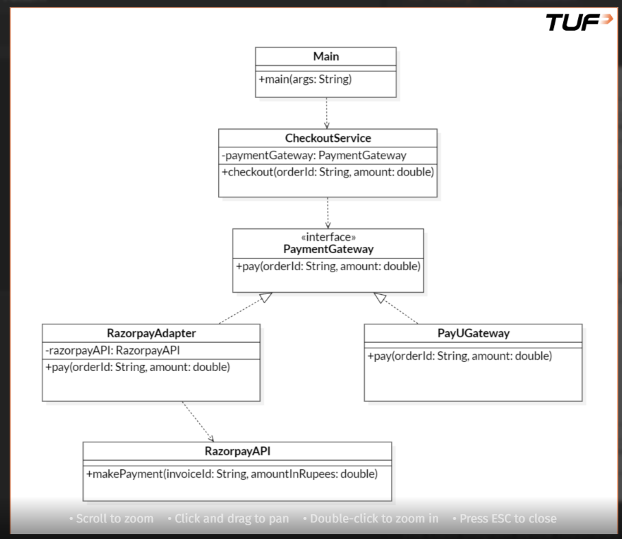

# Adapter Design Pattern — Complete Notes

---

# 1. What is Adapter Pattern?

Adapter Pattern is a Structural Design Pattern that allows two incompatible interfaces to work together.

It acts as a translator between two classes.

---

# Simple Definition

Adapter converts one interface into another interface that the client expects.

---

# Core Purpose

To integrate existing/third-party/legacy classes without modifying them.

---

# 2. Why is Adapter Pattern Used?

Used when:

- Existing class interface does not match application interface
- Third-party SDK has incompatible methods
- Legacy code integration required
- External APIs have different structures
- Want loose coupling between application and external services

---

# 3. What Problem Does It Solve?

Problem:

Application expects:

```java
pay(orderId, amount)
```

But third-party SDK provides:

```java
makePayment(invoiceId, amount)
```

Interfaces mismatch.

Without Adapter:
- Tight coupling
- Client directly depends on SDK
- Hard to switch providers
- Messy conversion logic

Adapter solves this by translating calls.

---

# 4. Main Components

| Component | Responsibility |
|---|---|
| Client | Uses target interface |
| Target Interface | Expected interface |
| Adapter | Converts calls |
| Adaptee | Existing incompatible class |

---

# 5. Mental Model

Adapter = Translator

Example:

English speaker ↔ Translator ↔ Japanese speaker

Client and adaptee speak different “languages”.

Adapter translates between them.

---

# Another Mental Model

Round peg into square hole.

Adapter reshapes connection.

---

# 6. Real-World Examples

- Mobile charger adapter
- HDMI to VGA converter
- USB-C to 3.5mm converter
- Payment gateway integration
- Cloud provider integration
- Legacy system integration

---

# 7. Real Software Example

Application expects:

```java
pay()
```

Razorpay SDK provides:

```java
makePayment()
```

Adapter translates:

```text
pay()
   ↓
makePayment()
```

---

# 8. Structure

```text
Client
   ↓
Target Interface
   ↓
Adapter
   ↓
Adaptee
```

---

# 9. Important Terminologies

---

## Target Interface

Interface expected by client.

Example:

```java
interface PaymentGateway {
    void pay(String orderId, double amount);
}
```

---

## Adaptee

Existing incompatible class.

Example:

```java
class RazorpayAPI {
    void makePayment(...)
}
```

Already exists.

Cannot modify easily.

---

## Adapter

Translator class.

Implements target interface and wraps adaptee.

Example:

```java
class RazorpayAdapter implements PaymentGateway
```

---

## Client

Uses abstraction.

Example:

```java
CheckoutService
```

Client should never directly depend on adaptee.

---

# 10. Flow of Calls

```text
CheckoutService
      ↓
PaymentGateway.pay()
      ↓
RazorpayAdapter.pay()
      ↓
RazorpayAPI.makePayment()
```

---

# 11. Runtime Object Relationship

```text
CheckoutService
      |
      ---> PaymentGateway
                 |
                 ---> RazorpayAdapter
                             |
                             ---> RazorpayAPI
```

---

# 12. Composition in Adapter

Adapter usually HAS-A adaptee.

Example:

```java
private RazorpayAPI razorpayAPI;
```

This is composition.

Adapter wraps existing class.

---

# 13. Constructor Flow Understanding

Code:

```java
new CheckoutService(
    new RazorpayAdapter(
        new RazorpayAPI()
    )
);
```

Execution order:

```text
1. Create RazorpayAPI
2. Create RazorpayAdapter
3. Inject adapter into CheckoutService
4. Create CheckoutService
```

Object creation happens inside-out.

---

# 14. Why Dependency Injection is Better?

BAD:

```java
class RazorpayAdapter {
    RazorpayAPI api = new RazorpayAPI();
}
```

Adapter creates dependency itself.

Tighter coupling.

---

# BETTER:

```java
class RazorpayAdapter {

    private RazorpayAPI api;

    public RazorpayAdapter(RazorpayAPI api) {
        this.api = api;
    }
}
```

Dependency injected externally.

Benefits:
- Loose coupling
- Better testing
- Easier mocking
- Better flexibility
- Enterprise architecture

---

# 15. Program to Interface, Not Implementation

Preferred:

```java
PaymentGateway gateway =
        new RazorpayAdapter(api);
```

Not preferred:

```java
RazorpayAdapter gateway =
        new RazorpayAdapter(api);
```

---

# Why?

Because application should depend on abstraction.

This allows replacing implementations easily.

---

# Mental Model

BAD:

```text
"I specifically want RazorpayAdapter"
```

GOOD:

```text
"I want anything capable of processing payment"
```

---

# 16. Left Side vs Right Side

Example:

```java
PaymentGateway gateway =
        new RazorpayAdapter(api);
```

---

## Left Side

```java
PaymentGateway gateway
```

Determines:
- abstraction
- accessible methods
- coupling level

---

## Right Side

```java
new RazorpayAdapter(api)
```

Determines:
- actual runtime behavior
- concrete implementation

---

# 17. Polymorphism

Even though reference type is:

```java
PaymentGateway
```

actual object is:

```java
RazorpayAdapter
```

This is runtime polymorphism.

---

# Visualization

```text
PaymentGateway  ---> RazorpayAdapter
```

---

# 18. Why Adapter Is Powerful?

Adapter protects application from external changes.

Suppose Razorpay changes:

```java
makePayment()
```

to:

```java
processTransaction()
```

ONLY adapter changes.

Entire application remains untouched.

---

# 19. Advantages

| Advantage | Explanation |
|---|---|
| Loose coupling | Client independent from SDK |
| Reuse existing code | No rewrite needed |
| Easy provider switching | Replace adapters easily |
| Open/Closed Principle | Add adapters without modifying client |
| Better maintainability | Central conversion logic |

---

# 20. Disadvantages

| Disadvantage | Explanation |
|---|---|
| More classes | Extra abstraction |
| Too many adapters can increase complexity | Overengineering risk |
| Can hide poor architecture | Wrong abstraction sometimes |

---

# 21. Common Mistakes

---

## Mistake 1

Putting business logic inside adapter.

Adapter should mainly translate interfaces.

---

## Mistake 2

Client directly using adaptee.

Then adapter becomes useless.

---

## Mistake 3

Using concrete references everywhere.

BAD:

```java
RazorpayAdapter adapter
```

BETTER:

```java
PaymentGateway adapter
```

---

## Mistake 4

Creating dependencies inside class unnecessarily.

Prefer dependency injection.

---

# 22. Adapter vs Decorator

| Adapter | Decorator |
|---|---|
| Changes interface | Enhances behavior |
| Translator | Feature enhancer |
| Compatibility focus | Behavior extension |

---

# 23. Adapter vs Facade

| Adapter | Facade |
|---|---|
| Converts interface | Simplifies interface |
| Solves incompatibility | Reduces complexity |

---

# 24. When Adapter Is NOT Needed

If class already matches expected interface.

Example:

```java
class PayUGateway implements PaymentGateway
```

No adapter required.

---

# 25. Enterprise-Level Thinking

Real systems constantly integrate:
- payment gateways
- cloud providers
- databases
- external APIs
- vendor SDKs

Adapter creates a stable internal interface.

---

# 26. Industry Architecture Thinking

```text
Controller
   ↓
Service
   ↓
Interface
   ↓
Adapter
   ↓
External SDK/API
```

Very common enterprise flow.

---

# 27. Interview Perspective

Common interview use cases:
- Payment gateway integration
- Legacy system integration
- Multiple vendor support
- External API integration

---

# 28. Interview Golden Rule

Whenever interviewer says:

“Integrate third-party system”

Think:
- Adapter Pattern
- Interface abstraction
- Dependency injection

---

# 29. Important SOLID Principles Used

---

## Dependency Inversion Principle

High-level modules depend on abstraction.

Example:

```java
CheckoutService
    depends on
PaymentGateway
```

Not Razorpay directly.

---

## Open/Closed Principle

Can add:

```text
StripeAdapter
PaypalAdapter
PhonePeAdapter
```

without changing client code.

---

# 30. Final Intuition

Adapter is NOT about adding features.

It is about making incompatible systems communicate safely and cleanly.

---

# 31. Golden Summary

```text
Client speaks one language.

External SDK speaks another language.

Adapter translates between them.
```

---

# 32. Ultimate Mental Mapping

```text
Application
     ↓
Target Interface
     ↓
Adapter (Translator)
     ↓
Adaptee (Existing SDK)
```

---

# 33. Most Important Learning

Adapter protects your application architecture from external dependency changes.

That is the REAL power of Adapter Pattern.

# 34. UML Diagram

