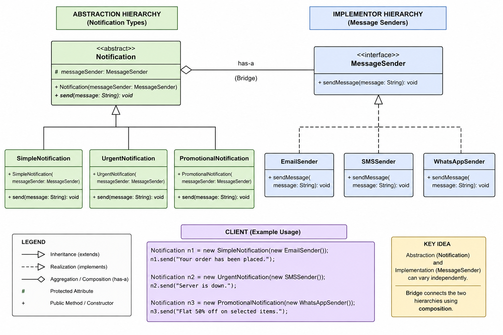

# Bridge Design Pattern

## 1. What is Bridge Design Pattern?

The **Bridge Design Pattern** is a **Structural Design Pattern** that separates an **abstraction** from its **implementation** so that both can vary independently.

In simple words:

> Bridge Pattern is used when two independent parts of a system can change separately, and we do not want to create a new class for every possible combination.

Bridge Pattern uses **composition over inheritance**.

---

## 2. Core Idea

The main idea of Bridge Pattern is:

```text
Separate "what needs to be done" from "how it is done".
```

In our example:

```text
What needs to be done?
-> Send a notification

How should it be done?
-> Send using Email, SMS, or WhatsApp
```

So we separate the system into two parts:

```text
Abstraction side:
- Notification
- SimpleNotification
- UrgentNotification
- PromotionalNotification

Implementation side:
- MessageSender
- EmailSender
- SMSSender
- WhatsAppSender
```

Then we connect both sides using composition:

```java
Notification notification = new UrgentNotification(new EmailSender());
```

Here:

```text
Notification = Abstraction
MessageSender = Implementor
```

---

## 3. Problem Without Bridge Pattern

Suppose we have different notification types:

```text
SimpleNotification
UrgentNotification
PromotionalNotification
```

And different sending channels:

```text
Email
SMS
WhatsApp
```

Without Bridge Pattern, we may create classes like:

```text
SimpleEmailNotification
SimpleSMSNotification
SimpleWhatsAppNotification

UrgentEmailNotification
UrgentSMSNotification
UrgentWhatsAppNotification

PromotionalEmailNotification
PromotionalSMSNotification
PromotionalWhatsAppNotification
```

This creates too many classes.

This problem is called:

```text
Class Explosion
```

If we have:

```text
3 notification types
3 sender types
```

Then without Bridge:

```text
3 × 3 = 9 classes
```

With Bridge:

```text
3 notification classes + 3 sender classes = 6 classes
```

As the system grows, Bridge Pattern keeps the design cleaner.

---

## 4. Why is Bridge Pattern used?

Bridge Pattern is used to:

```text
1. Avoid class explosion
2. Separate abstraction from implementation
3. Allow both sides to change independently
4. Use composition instead of inheritance
5. Improve flexibility
6. Improve maintainability
7. Follow Open/Closed Principle
8. Support runtime object combinations
```

---

## 5. When to use Bridge Pattern?

Use Bridge Pattern when:

```text
1. You have two independent dimensions of variation
2. Inheritance is creating too many combination classes
3. You want abstraction and implementation to evolve independently
4. You want to use composition over inheritance
5. You want runtime flexibility
```

In our example, the two independent dimensions are:

```text
Dimension 1: Notification type
Dimension 2: Sending channel
```

---

## 6. Mental Model / Intuition

Think of Bridge Pattern like this:

```text
Abstraction = Business-level operation
Implementation = Low-level execution
```

In our example:

```text
Notification = What kind of notification is this?
MessageSender = How will this notification be sent?
```

So:

```java
new UrgentNotification(new EmailSender());
new UrgentNotification(new SMSSender());
new SimpleNotification(new WhatsAppSender());
```

All these combinations are possible without creating separate classes for each combination.

---

## 7. Important Terms in Bridge Pattern

### 7.1 Abstraction

The abstraction is the high-level class used by the client.

In our code:

```java
Notification
```

It represents the notification concept.

It contains a reference to the implementor:

```java
protected MessageSender messageSender;
```

This reference is the actual bridge.

---

### 7.2 Refined Abstraction

Refined abstractions are concrete versions of the abstraction.

In our code:

```text
SimpleNotification
UrgentNotification
PromotionalNotification
```

They decide what type of notification behavior should be applied.

Example:

```text
UrgentNotification adds [URGENT] before sending the message.
```

---

### 7.3 Implementor

The implementor is the interface for the implementation side.

In our code:

```java
MessageSender
```

It defines how a message should be sent.

---

### 7.4 Concrete Implementor

Concrete implementors provide actual implementation logic.

In our code:

```text
EmailSender
SMSSender
WhatsAppSender
```

They decide the actual sending mechanism.

---

## 8. Structure Breakdown

### Abstraction Side

```text
Notification
  |
  |-- SimpleNotification
  |-- UrgentNotification
  |-- PromotionalNotification
```

Responsibility:

```text
Defines notification behavior.
Does not know the actual sending details.
Delegates sending work to MessageSender.
```

---

### Implementation Side

```text
MessageSender
  |
  |-- EmailSender
  |-- SMSSender
  |-- WhatsAppSender
```

Responsibility:

```text
Defines actual sending mechanism.
Does not know notification business type.
```

---

### Bridge Relationship

```text
Notification HAS-A MessageSender
```

In code:

```java
protected MessageSender messageSender;
```

This line connects both hierarchies.

This is the bridge.

---

## 9. Responsibility Flow

For this code:

```java
Notification notification = new UrgentNotification(new EmailSender());
notification.send("Server is down");
```

Flow:

```text
1. Client creates EmailSender.
2. Client injects EmailSender into UrgentNotification.
3. Client calls send() on Notification reference.
4. UrgentNotification adds [URGENT] to the message.
5. UrgentNotification delegates actual sending to MessageSender.
6. EmailSender sends the final message.
```

---

## 10. Who calls whom?

```text
Client
  |
  | calls send()
  v
UrgentNotification
  |
  | calls sendMessage()
  v
EmailSender
```

Detailed flow:

```text
Client
  -> notification.send("Server is down")

UrgentNotification
  -> messageSender.sendMessage("[URGENT] Server is down")

EmailSender
  -> prints/sends the email message
```

Important:

```text
Client does not directly call EmailSender.sendMessage().
UrgentNotification calls EmailSender through MessageSender interface.
```

---

## 11. Class Diagram

```text
                    +----------------------+
                    |    MessageSender     |
                    +----------------------+
                    | + sendMessage(msg)   |
                    +----------^-----------+
                               |
              -------------------------------------
              |                 |                 |
+-------------------+ +-------------------+ +----------------------+
|    EmailSender    | |     SMSSender     | |   WhatsAppSender     |
+-------------------+ +-------------------+ +----------------------+
| + sendMessage()   | | + sendMessage()   | | + sendMessage()      |
+-------------------+ +-------------------+ +----------------------+


                    +-----------------------------+
                    |        Notification          |
                    +-----------------------------+
                    | - messageSender             |
                    +-----------------------------+
                    | + send(message)             |
                    +-------------^---------------+
                                  |
             -----------------------------------------
             |                   |                   |
+----------------------+ +----------------------+ +--------------------------+
| SimpleNotification   | | UrgentNotification   | | PromotionalNotification  |
+----------------------+ +----------------------+ +--------------------------+
| + send(message)      | | + send(message)      | | + send(message)          |
+----------------------+ +----------------------+ +--------------------------+
```

Relationship:

```text
Notification HAS-A MessageSender
```

---

## 12. Object Interaction Flow

```text
Client
  |
  | creates
  v
EmailSender

Client
  |
  | injects EmailSender into
  v
UrgentNotification

Client
  |
  | calls send()
  v
UrgentNotification

UrgentNotification
  |
  | delegates to
  v
EmailSender
```

---

## 13. Complete Java Code

### File: MessageSender.java

```java
package implementor;

public interface MessageSender {
    void sendMessage(String message);
}
```

---

### File: EmailSender.java

```java
package implementor;

public class EmailSender implements MessageSender {

    @Override
    public void sendMessage(String message) {
        System.out.println("Sending Email: " + message);
    }
}
```

---

### File: SMSSender.java

```java
package implementor;

public class SMSSender implements MessageSender {

    @Override
    public void sendMessage(String message) {
        System.out.println("Sending SMS: " + message);
    }
}
```

---

### File: WhatsAppSender.java

```java
package implementor;

public class WhatsAppSender implements MessageSender {

    @Override
    public void sendMessage(String message) {
        System.out.println("Sending WhatsApp Message: " + message);
    }
}
```

---

### File: Notification.java

```java
package abstraction;

import implementor.MessageSender;

public abstract class Notification {

    protected MessageSender messageSender;

    public Notification(MessageSender messageSender) {
        this.messageSender = messageSender;
    }

    public abstract void send(String message);
}
```

---

### File: SimpleNotification.java

```java
package abstraction;

import implementor.MessageSender;

public class SimpleNotification extends Notification {

    public SimpleNotification(MessageSender messageSender) {
        super(messageSender);
    }

    @Override
    public void send(String message) {
        messageSender.sendMessage(message);
    }
}
```

---

### File: UrgentNotification.java

```java
package abstraction;

import implementor.MessageSender;

public class UrgentNotification extends Notification {

    public UrgentNotification(MessageSender messageSender) {
        super(messageSender);
    }

    @Override
    public void send(String message) {
        messageSender.sendMessage("[URGENT] " + message);
    }
}
```

---

### File: PromotionalNotification.java

```java
package abstraction;

import implementor.MessageSender;

public class PromotionalNotification extends Notification {

    public PromotionalNotification(MessageSender messageSender) {
        super(messageSender);
    }

    @Override
    public void send(String message) {
        messageSender.sendMessage("[PROMOTION] " + message);
    }
}
```

---

### File: Main.java

```java
import abstraction.Notification;
import abstraction.SimpleNotification;
import abstraction.UrgentNotification;
import abstraction.PromotionalNotification;

import implementor.EmailSender;
import implementor.SMSSender;
import implementor.WhatsAppSender;

public class Main {

    public static void main(String[] args) {

        Notification simpleEmailNotification =
                new SimpleNotification(new EmailSender());

        simpleEmailNotification.send("Your order has been placed.");

        Notification urgentSmsNotification =
                new UrgentNotification(new SMSSender());

        urgentSmsNotification.send("Server is down.");

        Notification promotionalWhatsAppNotification =
                new PromotionalNotification(new WhatsAppSender());

        promotionalWhatsAppNotification.send("Flat 50% off on selected items.");
    }
}
```

---

## 14. Output

```text
Sending Email: Your order has been placed.
Sending SMS: [URGENT] Server is down.
Sending WhatsApp Message: [PROMOTION] Flat 50% off on selected items.
```

---

## 15. Proper File Structure

```text
bridge-design-pattern/
│
├── README.md
│
└── src/
    │
    ├── Main.java
    │
    ├── abstraction/
    │   ├── Notification.java
    │   ├── SimpleNotification.java
    │   ├── UrgentNotification.java
    │   └── PromotionalNotification.java
    │
    └── implementor/
        ├── MessageSender.java
        ├── EmailSender.java
        ├── SMSSender.java
        └── WhatsAppSender.java
```

---

## 16. Deep Code Explanation

### MessageSender Interface

```java
public interface MessageSender {
    void sendMessage(String message);
}
```

This is the implementor interface.

It represents the implementation side of the Bridge Pattern.

Its responsibility is:

```text
Define how a message should be sent.
```

It does not care whether the notification is simple, urgent, or promotional.

---

### EmailSender Class

```java
public class EmailSender implements MessageSender {

    @Override
    public void sendMessage(String message) {
        System.out.println("Sending Email: " + message);
    }
}
```

This is a concrete implementor.

It sends the message using email.

Its responsibility is:

```text
Handle email-specific sending logic.
```

---

### SMSSender Class

```java
public class SMSSender implements MessageSender {

    @Override
    public void sendMessage(String message) {
        System.out.println("Sending SMS: " + message);
    }
}
```

This is another concrete implementor.

Its responsibility is:

```text
Handle SMS-specific sending logic.
```

---

### WhatsAppSender Class

```java
public class WhatsAppSender implements MessageSender {

    @Override
    public void sendMessage(String message) {
        System.out.println("Sending WhatsApp Message: " + message);
    }
}
```

This class handles WhatsApp-specific sending logic.

---

### Notification Abstract Class

```java
public abstract class Notification {

    protected MessageSender messageSender;

    public Notification(MessageSender messageSender) {
        this.messageSender = messageSender;
    }

    public abstract void send(String message);
}
```

This is the abstraction.

Important line:

```java
protected MessageSender messageSender;
```

This line creates the bridge between:

```text
Notification hierarchy
```

and

```text
MessageSender hierarchy
```

The constructor accepts a `MessageSender` object:

```java
public Notification(MessageSender messageSender) {
    this.messageSender = messageSender;
}
```

This allows us to inject any sender at runtime.

Example:

```java
new UrgentNotification(new EmailSender());
new UrgentNotification(new SMSSender());
```

The same notification type can work with different sender implementations.

---

### SimpleNotification Class

```java
public class SimpleNotification extends Notification {

    public SimpleNotification(MessageSender messageSender) {
        super(messageSender);
    }

    @Override
    public void send(String message) {
        messageSender.sendMessage(message);
    }
}
```

This is a refined abstraction.

It does not modify the message.

It simply delegates the message to the sender.

Flow:

```text
SimpleNotification receives message.
SimpleNotification calls messageSender.sendMessage(message).
Concrete sender sends the message.
```

---

### UrgentNotification Class

```java
public class UrgentNotification extends Notification {

    public UrgentNotification(MessageSender messageSender) {
        super(messageSender);
    }

    @Override
    public void send(String message) {
        messageSender.sendMessage("[URGENT] " + message);
    }
}
```

This is a refined abstraction.

It adds urgent behavior by prefixing the message with:

```text
[URGENT]
```

It does not care whether the message is sent by email, SMS, or WhatsApp.

It only handles notification-specific behavior.

Actual sending is delegated to `MessageSender`.

---

### PromotionalNotification Class

```java
public class PromotionalNotification extends Notification {

    public PromotionalNotification(MessageSender messageSender) {
        super(messageSender);
    }

    @Override
    public void send(String message) {
        messageSender.sendMessage("[PROMOTION] " + message);
    }
}
```

This is also a refined abstraction.

It adds promotional behavior by prefixing the message with:

```text
[PROMOTION]
```

Actual sending is still delegated to `MessageSender`.

---

### Main Class

```java
Notification simpleEmailNotification =
        new SimpleNotification(new EmailSender());
```

This creates:

```text
SimpleNotification + EmailSender
```

Meaning:

```text
Send a simple notification using email.
```

---

```java
simpleEmailNotification.send("Your order has been placed.");
```

Call flow:

```text
Client calls SimpleNotification.send()
SimpleNotification calls EmailSender.sendMessage()
EmailSender sends the message
```

---

```java
Notification urgentSmsNotification =
        new UrgentNotification(new SMSSender());
```

This creates:

```text
UrgentNotification + SMSSender
```

Meaning:

```text
Send an urgent notification using SMS.
```

---

```java
urgentSmsNotification.send("Server is down.");
```

Call flow:

```text
Client calls UrgentNotification.send()
UrgentNotification adds [URGENT]
UrgentNotification calls SMSSender.sendMessage()
SMSSender sends the message
```

---

```java
Notification promotionalWhatsAppNotification =
        new PromotionalNotification(new WhatsAppSender());
```

This creates:

```text
PromotionalNotification + WhatsAppSender
```

Meaning:

```text
Send a promotional notification using WhatsApp.
```

---

## 17. Pros

```text
1. Avoids class explosion.
2. Separates abstraction from implementation.
3. Allows both sides to evolve independently.
4. Uses composition over inheritance.
5. Supports runtime flexibility.
6. Improves maintainability.
7. Follows Open/Closed Principle.
8. Keeps responsibilities clean.
```

---

## 18. Cons

```text
1. Adds more classes.
2. Can feel slightly complex for beginners.
3. Can be overengineering if only one dimension varies.
4. Client may need to understand which abstraction and implementation to combine.
```

---

## 19. Common Mistakes

### Mistake 1: Using Bridge when only one dimension varies

Bridge is useful only when two dimensions vary independently.

In our example:

```text
Notification type varies.
Sender type also varies.
```

So Bridge makes sense.

---

### Mistake 2: Creating combination classes again

Bad:

```java
class UrgentEmailNotification {
}
```

Good:

```java
new UrgentNotification(new EmailSender());
```

---

### Mistake 3: Depending on concrete sender class

Bad:

```java
private EmailSender emailSender;
```

Good:

```java
private MessageSender messageSender;
```

Always depend on abstraction/interface.

---

### Mistake 4: Putting sender logic inside notification class

Bad:

```java
public class UrgentNotification {
    public void send(String message) {
        System.out.println("Sending Email: " + message);
    }
}
```

Good:

```java
messageSender.sendMessage("[URGENT] " + message);
```

Notification should handle notification behavior.

Sender should handle sending behavior.

---

## 20. Bridge vs Adapter

| Bridge | Adapter |
|---|---|
| Used during design | Used after design |
| Separates abstraction and implementation | Makes incompatible interfaces compatible |
| Prevents class explosion | Fixes interface mismatch |
| Planned flexibility | Compatibility solution |

In our example:

```text
Bridge:
Notification uses MessageSender
```

Adapter would be used if we had an existing third-party sender with an incompatible method and wanted to fit it into MessageSender.

---

## 21. Bridge vs Strategy

| Bridge | Strategy |
|---|---|
| Structural pattern | Behavioral pattern |
| Separates abstraction from implementation | Changes algorithm/behavior |
| Usually has two independent hierarchies | Usually has one strategy hierarchy |
| Focus is object structure | Focus is interchangeable behavior |

Important:

```text
Bridge intent:
Separate abstraction from implementation.

Strategy intent:
Switch algorithm or behavior at runtime.
```

In our example, `MessageSender` may look like Strategy because it is injected, but the intent is Bridge because we are separating two independent dimensions:

```text
Notification type
Sender type
```

---

## 22. Bridge vs Decorator

| Bridge | Decorator |
|---|---|
| Separates abstraction from implementation | Adds responsibilities dynamically |
| Has two different hierarchies | Wraps same interface |
| Avoids class explosion | Adds features without subclassing |
| Object contains implementor | Object wraps another object of same type |

In our example:

```text
Bridge:
UrgentNotification has EmailSender
```

Decorator would be:

```text
UrgentNotification wrapping another Notification
```

But here we are not wrapping the same interface.

We are connecting two different hierarchies.

---

## 23. Interview Perspective

### Short Definition

```text
Bridge Pattern is a structural design pattern that separates abstraction from implementation so both can vary independently.
```

---

### Interview Explanation

In our notification example, notification type and sending channel are two independent dimensions.

Notification type can be:

```text
Simple
Urgent
Promotional
```

Sender type can be:

```text
Email
SMS
WhatsApp
```

Without Bridge, we would create classes for every combination like:

```text
SimpleEmailNotification
UrgentSMSNotification
PromotionalWhatsAppNotification
```

This causes class explosion.

With Bridge, we create two hierarchies:

```text
Notification hierarchy
MessageSender hierarchy
```

Then `Notification` contains a `MessageSender` reference.

```java
protected MessageSender messageSender;
```

This allows us to combine them at runtime:

```java
Notification notification = new UrgentNotification(new EmailSender());
```

---

### Best Interview Line

```text
Bridge Pattern is useful when we have two independent dimensions of variation and inheritance would create too many subclasses. It separates abstraction from implementation using composition.
```

---

## 24. Final Revision

```text
Bridge Pattern = Abstraction HAS-A Implementor

In our code:

Notification HAS-A MessageSender

Notification side:
- SimpleNotification
- UrgentNotification
- PromotionalNotification

MessageSender side:
- EmailSender
- SMSSender
- WhatsAppSender

Bridge line:
protected MessageSender messageSender;

Client creates combination:
new UrgentNotification(new EmailSender());

Client calls:
notification.send("Server is down");

Flow:
Client -> UrgentNotification -> EmailSender

Main benefit:
Avoids class explosion and allows abstraction and implementation to change independently.
```

# Class Diagram
