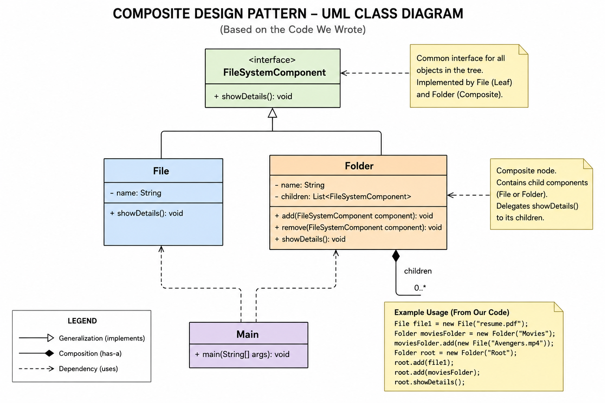

# COMPOSITE DESIGN PATTERN — COMPLETE INTERVIEW & REVISION NOTES

# Definition

Composite Design Pattern is a Structural Design Pattern that allows us to compose objects into tree structures and treat individual objects and groups of objects uniformly.

It is used for:
- hierarchical structures
- recursive object trees
- part-whole relationships

---

# Core Idea

Composite Pattern creates:

```text
Object Tree
```

where:
- Leaf = individual object
- Composite = group/container object

Both implement the same interface.

This allows:

```text
Uniform Treatment
```

Meaning:
Client treats:
- single object
- group of objects

in the same way.

---

# Best Mental Model

# File System

```text
Root
 ├── resume.pdf
 ├── photo.png
 └── Movies
      ├── Avengers.mp4
      └── Batman.mp4
```

Here:
- File = Leaf
- Folder = Composite

Folder can contain:
- Files
- Folders

This creates recursive hierarchy.

---

# Main Goal

Without Composite:

```java
if(object instanceof File)
    fileLogic();

if(object instanceof Folder)
    folderLogic();
```

Problems:
- many if-else conditions
- tight coupling
- duplicate traversal logic
- recursion complexity exposed to client

Composite solves this by introducing:

```java
Component interface
```

Client simply calls:

```java
component.operation();
```

without caring:
- leaf?
- composite?
- nested structure?
- recursion depth?

---

# Key Concepts

# 1. Component

Common abstraction/interface for all objects.

Example:

```java
interface FileSystemComponent
```

Defines common operations.

---

# 2. Leaf

End object/node.

Cannot contain children.

Examples:
- File
- Button
- Employee

Leaf performs actual work.

---

# 3. Composite

Container object.

Can contain:
- leaves
- composites

Examples:
- Folder
- Panel
- Department

Composite recursively delegates operations to children.

---

# 4. Recursive Composition

MOST IMPORTANT CONCEPT.

Composite contains:

```java
List<Component>
```

Meaning:
same abstraction recursively reused.

This creates tree structure.

---

# 5. Uniform Treatment

Client uses same interface for:
- single object
- group object

Example:

```java
component.showDetails();
```

works for:
- file
- folder
- nested folder

---

# 6. Part-Whole Hierarchy

Composite models:

```text
whole-part relationship
```

Examples:
- Folder → Files
- Department → Employees
- Menu → MenuItems

---

# Structure

```text
                  +------------------+
                  |    Component     |
                  +------------------+
                  | +operation()     |
                  +------------------+
                           ^
          ┌────────────────┴──────────────┐
          |                               |
   +-------------+              +----------------+
   |    Leaf     |              |   Composite    |
   +-------------+              +----------------+
   | operation() |              | children       |
   +-------------+              | add()          |
                                | remove()       |
                                | operation()    |
                                +----------------+
```

---

# Relationship

Composite HAS-A:

```java
List<Component>
```

This is the heart of Composite Pattern.

---

# Composite Recursive Flow

Example:

```text
Root
 ├── File1
 ├── File2
 └── Movies
      ├── Avengers.mp4
      └── Batman.mp4
```

Execution:

```java
root.showDetails();
```

Flow:

```text
Root.showDetails()

→ print Root

→ File1.showDetails()
→ File2.showDetails()

→ Movies.showDetails()
      → print Movies

      → Avengers.showDetails()
      → Batman.showDetails()
```

Recursive delegation.

---

# Responsibility Flow

# Client Responsibility

Only calls:

```java
component.operation();
```

Client should not know:
- hierarchy
- recursion
- leaf/composite difference

---

# Leaf Responsibility

Performs actual work.

Does NOT manage children.

---

# Composite Responsibility

- stores children
- manages hierarchy
- delegates recursively
- controls traversal

---

# Call Flow

```text
Client
   ↓
Composite
   ↓
Child
   ↓
Child
   ↓
Leaf
```

Recursive delegation chain.

---

# Real-World Examples

# 1. File System

```text
Folder
 ├── File
 └── Folder
```

---

# 2. UI Component Tree

```text
Panel
 ├── Button
 ├── TextField
 └── Panel
```

Examples:
- React
- Android
- Swing

---

# 3. HTML DOM

```html
<div>
    <p>Hello</p>
    <div>
        <span>Text</span>
    </div>
</div>
```

DOM internally uses Composite Pattern.

---

# 4. Menu Systems

```text
Menu
 ├── MenuItem
 └── SubMenu
```

---

# 5. Organization Hierarchy

```text
CEO
 ├── Manager
 │    ├── Developer
 │    └── Tester
```

---

# 6. Product Categories

```text
Electronics
 ├── Mobiles
 └── Laptops
```

---

# 7. Comment Threads

```text
Comment
 └── Reply
      └── Reply
```

---

# 8. Permission Hierarchy

```text
Admin
 ├── HR Permissions
 ├── Finance Permissions
```

---

# When To Use Composite Pattern

Use Composite when:

- tree structure exists
- recursive hierarchy exists
- part-whole relationship exists
- uniform operations required
- nested objects exist
- recursive traversal needed
- client should not care about complexity

---

# When NOT To Use

Avoid Composite when:
- no hierarchy exists
- no recursive structure exists
- objects are unrelated
- recursion adds unnecessary complexity

---

# Transparent vs Safe Composite

VERY IMPORTANT INTERVIEW TOPIC.

---

# Transparent Composite

All methods defined in Component.

Example:

```java
interface Component {
    void operation();
    void add(Component c);
    void remove(Component c);
}
```

Problem:
Leaf also gets:
- add()
- remove()

which does not make sense.

---

# Safe Composite

Child-management methods only inside Composite.

Example:

```java
interface Component {
    void operation();
}

class Composite {
    void add(Component c)
}
```

Safer design.

Preferred in real-world systems.

---

# Advantages

# 1. Uniform Treatment

Client handles:
- single object
- group

same way.

---

# 2. Simplifies Client

No type checking required.

---

# 3. Recursive Structures Become Easy

Natural tree modeling.

---

# 4. Open/Closed Principle

Easy to add new leaf/composite types.

---

# 5. Cleaner Traversal Logic

Recursion centralized.

---

# 6. Flexible Hierarchy

Tree can grow dynamically.

---

# Disadvantages

# 1. Over-Generalization

Can become too generic.

---

# 2. Hard Validation

Leaf should not manage children.

---

# 3. Deep Recursion Complexity

Large trees become harder to debug.

---

# 4. Performance Cost

Recursive traversal can be expensive.

---

# Common Mistakes

# Mistake 1

Using Composite where no hierarchy exists.

---

# Mistake 2

Putting child-management logic in Leaf.

Wrong responsibility distribution.

---

# Mistake 3

Not understanding recursive delegation.

MOST IMPORTANT CONCEPT.

---

# Mistake 4

Exposing internal child list publicly.

Bad encapsulation.

---

# Mistake 5

Infinite recursion due to cyclic references.

Example:
Folder contains itself.

---

# Time Complexity

# Traversal

```text
O(N)
```

where:
- N = total nodes in tree

---

# Space Complexity

Recursive stack:

```text
O(H)
```

where:
- H = tree height

---

# Interview Questions and Answers

# Q1. What is Composite Design Pattern?

Composite Pattern allows treating individual objects and groups of objects uniformly using tree structures.

---

# Q2. Why is Composite Pattern used?

To model hierarchical recursive structures and simplify client interaction.

---

# Q3. What problem does it solve?

It removes:
- complex if-else
- type checks
- duplicate traversal logic

by providing common abstraction.

---

# Q4. What are main components of Composite Pattern?

- Component
- Leaf
- Composite

---

# Q5. Difference between Leaf and Composite?

Leaf:
- no children
- actual work

Composite:
- manages children
- delegates recursively

---

# Q6. What is recursive composition?

Composite contains:

```java
List<Component>
```

allowing recursive tree formation.

---

# Q7. What is uniform treatment?

Client treats:
- single object
- group object

using same interface.

---

# Q8. What is the heart of Composite Pattern?

```java
List<Component>
```

inside Composite.

---

# Q9. Best real-world example?

File system.

---

# Q10. What is recursive delegation?

Composite forwards operation to children recursively.

---

# Q11. Why is Composite considered recursive?

Because composite contains same abstraction again.

Example:

```java
List<Component>
```

---

# Q12. Composite vs Decorator?

Composite:
- tree hierarchy
- parent-child structure

Decorator:
- adds behavior dynamically
- wrapper chain

---

# Q13. Composite vs Adapter?

Composite:
- recursive hierarchy

Adapter:
- compatibility between interfaces

---

# Q14. Composite vs Facade?

Composite:
- recursive tree

Facade:
- simplified entry point

---

# Q15. Composite vs Iterator?

Composite:
- builds hierarchy

Iterator:
- traverses hierarchy

Often used together.

---

# Q16. What is transparent composite?

All methods exposed in Component interface.

Leaf also gets unsupported methods.

---

# Q17. What is safe composite?

Child-management methods only inside Composite.

Preferred approach.

---

# Q18. Why is safe composite preferred?

Because Leaf should not expose:
- add()
- remove()

---

# Q19. Where is Composite used in backend systems?

- category hierarchy
- permission trees
- comments/replies
- org hierarchy
- filesystem modeling

---

# Q20. How does recursion work in Composite?

Composite loops through children:

```java
for(child : children)
    child.operation();
```

Child may again be Composite.

---

# Q21. What design principle does Composite follow?

Open/Closed Principle.

---

# Q22. Biggest benefit of Composite?

Uniform treatment + recursive hierarchy handling.

---

# Q23. Biggest challenge in Composite?

Managing deep recursive trees.

---

# Q24. Can Composite contain Leaf and Composite both?

Yes.

That is the entire purpose.

---

# Q25. What is part-whole hierarchy?

Whole object contains smaller parts.

Example:

```text
Folder contains Files/Folders
```

---

# Pattern Recognition Trick

If interviewer says:
- hierarchy
- tree
- nested structure
- recursive containment
- filesystem
- menus
- DOM
- UI tree

Immediately think:

```text
Composite Pattern
```

---

# Golden Rule

Whenever:

```text
Object contains same type of objects
```

think:

```text
Composite Pattern
```

---

# Ultimate Mental Model

```text
Every node is a component.
Some components contain more components.
```

That is Composite Pattern.

# Class Diagram
