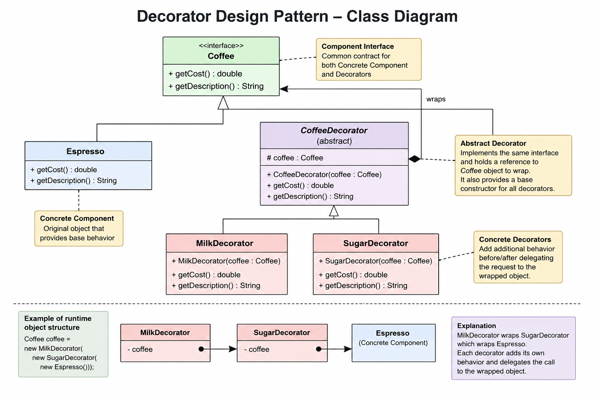

# Decorator Design Pattern

# 1. Introduction

Decorator Design Pattern is a Structural Design Pattern used to dynamically add new behavior or responsibilities to an object at runtime without modifying the original object’s code.

Instead of changing the existing class or creating many subclasses, we wrap the original object inside another object called a decorator.

The decorator adds additional behavior before or after delegating the request to the wrapped object.

The most important idea is:

```text
Behavior extension happens dynamically through object wrapping.
```

Decorator pattern follows:

- Composition over inheritance
- Open Closed Principle
- Runtime flexibility

---

# 2. Core Problem Decorator Solves

The biggest problem Decorator solves is:

# Class Explosion

Suppose we have a coffee system.

Base coffee:

```text
Espresso
```

Optional add-ons:

```text
Milk
Sugar
Cream
Chocolate
```

If we use inheritance:

```text
MilkEspresso
SugarEspresso
CreamEspresso
MilkSugarEspresso
MilkSugarCreamEspresso
ChocolateCreamMilkSugarEspresso
```

As features increase, subclasses grow exponentially.

With:

```text
N optional features
```

possible combinations become:

```text
2^N
```

This becomes impossible to maintain.

Decorator solves this problem by dynamically combining behaviors at runtime.

---

# 3. Main Idea of Decorator Pattern

Decorator wraps an object inside another object that implements the same interface.

Example:

```java
Coffee coffee =
    new MilkDecorator(
        new SugarDecorator(
            new Espresso()));
```

Here:

```text
MilkDecorator wraps SugarDecorator
SugarDecorator wraps Espresso
```

Each wrapper adds its own functionality.

---

# 4. Mental Model

Decorator pattern is easiest to understand using a gift wrapping analogy.

Imagine:

```text
Phone
   wrapped in gift paper
      wrapped in ribbon
         wrapped in greeting card
```

Every wrapper adds something new.

But internally, the original object still exists.

Decorator works exactly the same way.

---

# 5. Recursive Mental Model

The most important concept in Decorator Pattern is recursive composition.

Decorator stores a reference of the SAME interface type.

Example:

```java
protected Coffee coffee;
```

Not:

```java
protected Espresso espresso;
```

This is extremely important.

Because the decorator can now wrap:

- Espresso
- MilkDecorator
- SugarDecorator
- Any Coffee implementation

This recursive structure allows infinite chaining.

---

# 6. Runtime Object Structure

Suppose we create:

```java
Coffee coffee =
    new MilkDecorator(
        new SugarDecorator(
            new Espresso()));
```

Actual runtime object graph becomes:

```text
MilkDecorator
      ↓
SugarDecorator
      ↓
Espresso
```

This is NOT inheritance hierarchy.

This is object composition hierarchy.

Very important distinction.

---

# 7. How Method Calls Flow

Suppose:

```java
coffee.getCost();
```

Execution flow:

```text
MilkDecorator.getCost()
    ↓
SugarDecorator.getCost()
    ↓
Espresso.getCost()
```

Then return flow:

```text
Espresso returns 100

SugarDecorator:
100 + 10 = 110

MilkDecorator:
110 + 20 = 130
```

Final result:

```text
130
```

This recursive delegation flow is the heart of Decorator Pattern.

---

# 8. Structure of Decorator Pattern

Decorator Pattern usually contains four major parts.

---

# 8.1 Component Interface

Defines common contract.

Example:

```java
interface Coffee
```

This ensures both original objects and decorators behave uniformly.

---

# 8.2 Concrete Component

The original base object.

Example:

```java
class Espresso implements Coffee
```

Contains default behavior.

---

# 8.3 Abstract Decorator

Common wrapper base class.

Example:

```java
abstract class CoffeeDecorator implements Coffee
```

Stores wrapped object reference.

---

# 8.4 Concrete Decorators

Actual behavior-extending wrappers.

Example:

```java
MilkDecorator
SugarDecorator
```

Each decorator:

1. delegates call
2. adds additional behavior

---

# 9. Why Decorator Uses Both Inheritance and Composition

This confuses many developers.

Decorator uses BOTH.

---

# Inheritance Usage

```java
class MilkDecorator extends CoffeeDecorator
```

This provides:

- type compatibility
- polymorphism
- interchangeability

Meaning:

```java
Coffee coffee = new MilkDecorator(...);
```

works.

---

# Composition Usage

```java
protected Coffee coffee;
```

Decorator HAS-A Coffee object.

This is composition.

Actual behavior extension happens through composition.

That is why Decorator is called:

# Composition Over Inheritance

Decorator uses inheritance only for identity/type compatibility.

Behavior reuse comes from composition.

---

# 10. Why Inheritance Alone Fails

Suppose only inheritance existed.

Example:

```text
MilkEspresso
SugarEspresso
CreamEspresso
MilkSugarEspresso
CreamMilkSugarEspresso
```

With many features:

```text
2^N combinations
```

Classes become unmanageable.

Inheritance is static.

Decorator enables dynamic combinations at runtime.

---

# 11. Why Abstract Decorator Class?

Example:

```java
abstract class CoffeeDecorator implements Coffee
```

Purpose:

- avoid duplicate code
- centralize wrapped object storage
- provide common decorator foundation

Without abstract class, every decorator would duplicate:

```java
private Coffee coffee;

public MilkDecorator(Coffee coffee) {
    this.coffee = coffee;
}
```

Abstract class solves this repetition.

---

# 12. Understanding super(coffee)

Example:

```java
public MilkDecorator(Coffee coffee) {
    super(coffee);
}
```

`super(coffee)` calls parent constructor.

Meaning:

```java
CoffeeDecorator(Coffee coffee)
```

gets executed.

Parent constructor stores wrapped object.

Example:

```java
this.coffee = coffee;
```

This creates internal wrapping structure.

---

# 13. Constructor Call Flow

Suppose:

```java
new MilkDecorator(
    new SugarDecorator(
        new Espresso()))
```

Execution:

---

## Step 1

```java
new Espresso()
```

Creates Espresso object.

---

## Step 2

```java
new SugarDecorator(espresso)
```

Calls:

```java
super(espresso);
```

Stores Espresso inside SugarDecorator.

Structure:

```text
SugarDecorator
    ↓
Espresso
```

---

## Step 3

```java
new MilkDecorator(sugarDecorator)
```

Calls:

```java
super(sugarDecorator);
```

Stores SugarDecorator inside MilkDecorator.

Final structure:

```text
MilkDecorator
    ↓
SugarDecorator
    ↓
Espresso
```

---

# 14. Deep Call Stack Visualization

Suppose:

```java
coffee.getCost();
```

Execution:

```text
MilkDecorator.getCost()
    waits for↓

SugarDecorator.getCost()
    waits for↓

Espresso.getCost()
    returns 100
```

Then return unwinds upward:

```text
SugarDecorator:
100 + 10 = 110

MilkDecorator:
110 + 20 = 130
```

Final:

```text
130
```

Decorator behaves like recursive function calls.

---

# 15. Open Closed Principle

Decorator perfectly follows Open Closed Principle.

Open for extension:
- Add new decorators

Closed for modification:
- Existing classes unchanged

Example:

Add:

```java
class CreamDecorator
```

without changing Espresso class.

---

# 16. Dynamic Runtime Extension

Biggest power of Decorator:

Features added dynamically at runtime.

Example:

```java
Coffee coffee =
    new MilkDecorator(
        new SugarDecorator(
            new Espresso()));
```

Different combinations can be built dynamically.

---

# 17. Difference Between Adapter and Decorator

Many interviews ask this.

---

# Decorator

Purpose:
- Add new behavior

Example:

```text
Coffee → MilkCoffee
```

Same interface maintained.

Focus:
- behavior enhancement

---

# Adapter

Purpose:
- Convert incompatible interfaces

Example:

```text
RazorpayAPI → PaymentGateway
```

Focus:
- compatibility

---

# Key Difference

Decorator:
- enhancement

Adapter:
- translation

---

# 18. Advantages

## 1. Runtime Flexibility

Features added dynamically.

---

## 2. Avoids Class Explosion

No need for hundreds of subclasses.

---

## 3. Reusable Decorators

MilkDecorator works with any Coffee.

---

## 4. Follows Open Closed Principle

Existing code unchanged.

---

## 5. Composition Over Inheritance

Flexible design.

---

# 19. Disadvantages

## 1. Many Small Objects

Too many wrappers possible.

---

## 2. Debugging Complexity

Nested wrappers harder to trace.

---

## 3. Order Dependency

Example:

```text
Compression → Encryption
```

may differ from:

```text
Encryption → Compression
```

---

## 4. Recursive Flow Hard for Beginners

Understanding call chain takes practice.

---

# 20. Common Mistakes

## Mistake 1

Using inheritance for all combinations.

Wrong:

```text
MilkSugarCoffee
CreamMilkSugarCoffee
```

---

## Mistake 2

Decorator not implementing same interface.

Decorator must behave like component.

---

## Mistake 3

Forgetting delegation.

Wrong:

```java
return 20;
```

Correct:

```java
return coffee.getCost() + 20;
```

---

## Mistake 4

Modifying original class directly.

Decorator exists to avoid modification.

---

# 21. Real-World Examples

## Coffee Systems

Milk, sugar, cream add-ons.

---

## Pizza Toppings

Cheese, olives, mushroom.

---

## Burger Add-ons

Extra cheese, mayo, sauces.

---

## Java IO Classes

Most famous example.

```java
BufferedReader br =
    new BufferedReader(
        new InputStreamReader(
            new FileInputStream("abc.txt")));
```

Each object wraps another object.

---

## Middleware Systems

Authentication
Logging
Compression
Caching

Each layer decorates request processing.

---

# 22. Interview-Level Understanding

Most important interview statement:

```text
Decorator uses inheritance for type compatibility,
but behavior extension happens through composition.
```

Another important statement:

```text
Every decorator:
1. IS-A Component
2. HAS-A Component
```

This dual relationship is the heart of Decorator Pattern.

---

# 23. One-Line Definition

```text
Decorator Pattern dynamically adds responsibilities
to objects at runtime using wrapper objects that
implement the same interface.
```

---

# 24. Final Mental Model

Decorator is basically:

```text
Recursive Wrapper Chaining
```

Every wrapper:

1. receives request
2. delegates request downward
3. enhances result
4. returns upward

This creates dynamic layered behavior extension.

