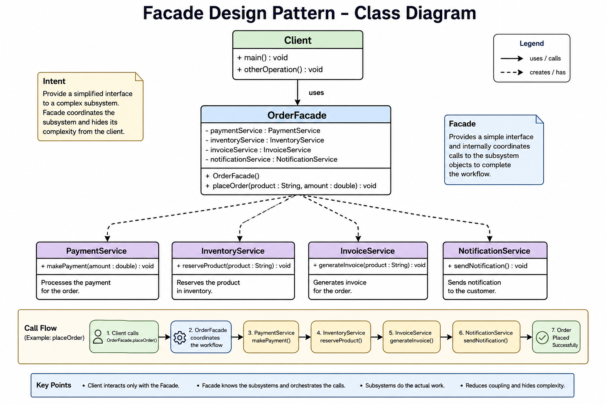

# Facade Design Pattern

# Definition

Facade Design Pattern is a Structural Design Pattern that provides a simplified unified interface to a complex subsystem.

Instead of exposing multiple subsystem classes directly to the client, a Facade exposes a single clean entry point that internally coordinates all subsystem interactions.

The client interacts with only the facade, while the facade handles the complexity behind the scenes.

---

# Core Purpose

Facade exists to:

- Hide system complexity
- Simplify client interaction
- Coordinate workflows
- Reduce client coupling with subsystems
- Provide clean APIs
- Centralize orchestration logic

---

# Core Idea

Without Facade:

Client directly talks to many services/classes.

```text
Client
  ├── PaymentService
  ├── InventoryService
  ├── NotificationService
  ├── InvoiceService
  └── ShippingService
```

Client must know:
- all services
- call sequence
- dependencies
- workflow handling

This creates complexity.

---

With Facade:

```text
Client
   ↓
OrderFacade
   ↓
Subsystems
```

Client only calls:

```java
orderFacade.placeOrder();
```

Facade handles everything internally.

---

# Mental Model (MOST IMPORTANT)

# Receptionist Analogy

Imagine a hospital.

Without receptionist:
- You find doctor yourself
- You handle billing
- You find pharmacy
- You coordinate tests manually

Very complicated.

---

With receptionist:
You simply say:

```text
"I need treatment"
```

Receptionist coordinates:
- doctor
- billing
- tests
- reports

You do not see internal complexity.

That receptionist is the Facade.

---

# Another Mental Model

Facade is like:

- front desk
- manager
- coordinator
- workflow orchestrator
- gateway
- central entry point

It simplifies communication with a complex system.

---

# Important Intuition

Facade DOES NOT:
- replace subsystems
- remove subsystem complexity internally
- contain all business logic

Facade mainly:
- coordinates
- delegates
- simplifies access

Subsystems still perform actual work.

---

# Why Facade is Used

Large systems become difficult because clients:
- know too many classes
- repeat orchestration logic
- manage call order manually
- become tightly coupled
- are harder to maintain

Facade solves this by centralizing workflow coordination.

---

# Problems Solved by Facade

## 1. Client Complexity

Without facade:

```java
paymentService.pay();
inventoryService.reserve();
invoiceService.generate();
notificationService.send();
shippingService.ship();
```

Client handles everything.

---

With facade:

```java
orderFacade.placeOrder();
```

Much cleaner.

---

## 2. Tight Coupling

Without facade:
Client depends on many subsystem classes.

With facade:
Client depends on one facade only.

---

## 3. Duplicate Workflow Logic

Multiple clients repeating same workflow.

Facade centralizes orchestration.

---

## 4. Difficult Maintenance

Changing workflow sequence requires updating many clients.

Facade solves this by keeping workflow in one place.

---

# When to Use Facade

Use Facade when:

## Multiple Subsystems Exist

Example:
- payment
- inventory
- notification
- shipping
- invoice

---

## Workflow Coordination is Repeated

Same sequence repeated across multiple clients.

---

## Complex APIs Need Simplification

Subsystem complexity should be hidden.

---

## You Want Loose Coupling

Client should not know internal details.

---

## You Want Clean Architecture

Facade creates cleaner boundaries.

---

## Legacy Systems are Complex

Facade often wraps old complicated systems.

---

# When NOT to Use Facade

Avoid facade when:
- system is already simple
- only one or two classes exist
- no orchestration needed
- abstraction adds unnecessary complexity

---

# Structure of Facade Pattern

## 1. Client

Uses facade only.

Does not know subsystem complexity.

---

## 2. Facade

Central coordinator.

Responsibilities:
- orchestration
- workflow management
- delegating calls
- hiding complexity

---

## 3. Subsystems

Actual worker classes.

Examples:
- PaymentService
- InventoryService
- NotificationService

Each subsystem has focused responsibility.

---

# Responsibility Flow

```text
Client
   ↓
Facade
   ↓
Subsystems
```

---

# Who Knows Whom?

## Client knows:
- Facade

## Facade knows:
- All subsystem classes

## Subsystems know:
- Their own logic only

Subsystems SHOULD NOT know facade.

---

# Important Dependency Direction

Correct:

```text
Facade → Subsystems
```

Wrong:

```text
Subsystems → Facade
```

---

# Call Flow Understanding

## Example: Order Placement

Client calls:

```java
orderFacade.placeOrder();
```

Facade internally:

```java
paymentService.pay();
inventoryService.reserve();
invoiceService.generate();
notificationService.send();
```

Client never sees internal workflow.

---

# Workflow Coordination Understanding

Facade acts like a conductor.

Like orchestra conductor:
- coordinates timing
- manages sequence
- controls interactions

Subsystems perform actual work.

---

# Real-World Examples

# 1. E-Commerce Checkout

Checkout involves:
- cart validation
- payment
- inventory
- invoice
- shipping
- notifications

User clicks:
```text
Place Order
```

Facade coordinates entire flow.

---

# 2. Banking System

Money transfer involves:
- validate account
- check balance
- debit
- credit
- audit log
- notification

Client calls:

```java
bankFacade.transferMoney();
```

---

# 3. Food Delivery Apps

Order placement:
- restaurant confirmation
- payment
- rider allocation
- tracking
- notification

Facade handles orchestration.

---

# 4. Computer Startup (Classic Example)

Power button internally:
- starts CPU
- initializes RAM
- loads OS
- checks hardware

User only presses:
```text
Power ON
```

Facade hides startup complexity.

---

# 5. Spring Boot Service Layer

Very common in enterprise applications.

Controller:

```java
orderService.placeOrder();
```

Service internally coordinates:
- repositories
- payment services
- kafka
- notifications

Service layer often behaves like Facade.

---

# Enterprise Architecture Understanding

Facade is extremely common in:

- service layer
- orchestration layer
- API gateway
- BFF (Backend for Frontend)
- aggregator services

---

# Facade in Microservices

Facade often aggregates multiple microservices.

Example:

```text
CheckoutFacade
   ├── Payment Service
   ├── Inventory Service
   ├── Coupon Service
   ├── Delivery Service
   └── Notification Service
```

Client gets one clean API.

---

# Step-by-Step Approach to Identify Facade

Ask these questions:

## Is client calling too many classes?

## Is workflow coordination repeated?

## Does client know call sequence?

## Is onboarding difficult because of subsystem complexity?

## Do we need one clean API?

If YES → Facade is likely useful.

---

# Step-by-Step Design Process

## Step 1: Identify Subsystems

Example:
- PaymentService
- InventoryService
- ShippingService

---

## Step 2: Identify Common Workflow

Example:
"Place Order"

---

## Step 3: Create Facade

Example:

```java
OrderFacade
```

---

## Step 4: Move Workflow Coordination into Facade

Facade controls orchestration.

---

## Step 5: Expose Simple API

Client uses:

```java
orderFacade.placeOrder();
```

---

# Facade vs Adapter (VERY IMPORTANT)

# Facade

Purpose:
Simplify complex systems.

```text
Many APIs → One Simple API
```

Facade focuses on orchestration and simplification.

---

# Adapter

Purpose:
Convert incompatible interfaces.

```text
One Interface → Another Interface
```

Adapter focuses on compatibility.

---

# Mental Difference

Facade:
Receptionist.

Adapter:
Travel plug converter.

---

# Example Difference

# Facade Example

```java
orderFacade.placeOrder();
```

Simplifies workflow.

---

# Adapter Example

```java
paymentGateway.pay();
```

Internally converting Razorpay API to common interface.

---

# Facade vs Decorator

# Facade

Purpose:
Simplify subsystem usage.

Focus:
Workflow coordination.

---

# Decorator

Purpose:
Add behavior dynamically.

Focus:
Runtime feature enhancement.

---

# Example Difference

Facade:

```java
checkoutFacade.checkout();
```

Coordinates systems.

---

Decorator:

```java
new MilkDecorator(new Coffee());
```

Adds features dynamically.

---

# Facade vs Service Layer

This is VERY IMPORTANT for interviews.

Many service layers behave like Facades.

But conceptually:

# Facade
Mostly:
- simplification
- orchestration
- delegation

---

# Service Layer
May additionally contain:
- business rules
- validations
- transaction handling

In real systems both concepts overlap heavily.

---

# Advantages of Facade

# 1. Simplifies Client Code

Client uses one API.

---

# 2. Reduces Coupling

Client depends on facade instead of many subsystems.

---

# 3. Centralizes Workflow

Workflow maintained in one place.

---

# 4. Better Readability

Cleaner APIs.

---

# 5. Easier Maintenance

Workflow changes affect only facade.

---

# 6. Better Layered Architecture

Excellent for enterprise systems.

---

# 7. Easier Onboarding

Developers interact with clean interfaces.

---

# Disadvantages of Facade

# 1. Can Become God Class

Too many responsibilities may accumulate.

---

# 2. May Hide Useful Flexibility

Advanced clients may need direct subsystem access.

---

# 3. Over-Abstraction Risk

Do not create facade unnecessarily.

---

# 4. Tight Coupling Inside Facade

Facade internally depends on subsystem details.

This is acceptable.

---

# Common Mistakes

# Mistake 1:
Putting entire business logic into facade.

Facade should mainly coordinate.

---

# Mistake 2:
Subsystem depending on facade.

Wrong dependency direction.

---

# Mistake 3:
Creating giant mega-facade.

Better:
- PaymentFacade
- CheckoutFacade
- OrderFacade

Split by workflows.

---

# Mistake 4:
Facade becoming utility class.

Facade should represent workflows, not random helper methods.

---

# Mistake 5:
Client bypassing facade everywhere.

Then facade loses purpose.

---

# Interview Perspective

# Strong Interview Statement

"I will introduce a Facade to centralize orchestration and reduce client complexity."

Very strong design statement.

---

# Common Interview Questions

## Q1. Why use Facade?

To simplify client interaction with complex systems.

---

## Q2. Does Facade remove subsystem complexity?

No.
It hides complexity from clients.

---

## Q3. Can subsystems still be used directly?

Yes.
Facade does not block direct access.

---

## Q4. Is Facade tightly coupled internally?

Yes.
Facade knows subsystem details intentionally.

---

## Q5. Difference between Facade and Adapter?

Facade:
simplifies

Adapter:
converts

---

## Q6. Difference between Facade and Decorator?

Facade:
coordinates systems

Decorator:
adds runtime behavior

---

# Coding Assignment Thinking Process

If interviewer says:

"Design an order processing system"

Think:

## What subsystems exist?
- payment
- inventory
- notification
- invoice

---

## Is workflow coordination needed?

YES.

---

## Is client complexity increasing?

YES.

---

## Solution?

Introduce Facade.

---

# Backend Service Orchestration Thinking

Real enterprise systems often use facade-like orchestration.

Example:

```text
CheckoutFacade
   ├── PaymentService
   ├── InventoryService
   ├── CouponService
   ├── DeliveryService
   └── NotificationService
```

Client sees only:

```java
checkoutFacade.checkout();
```

---

# Important Design Principle

Facade follows:

## Encapsulation

Internal complexity hidden.

---

## Separation of Concerns

Client:
requests workflow

Facade:
coordinates workflow

Subsystems:
perform specialized work

---

# Java Example Structure

```text
facade-pattern/
│
├── Main.java
│
├── facade/
│   └── OrderFacade.java
│
├── subsystem/
│   ├── PaymentService.java
│   ├── InventoryService.java
│   ├── InvoiceService.java
│   └── NotificationService.java
```

---

# Flow Visualization

```text
Client
   |
   | placeOrder()
   v

OrderFacade
   |
   |--> PaymentService.pay()
   |
   |--> InventoryService.reserve()
   |
   |--> InvoiceService.generate()
   |
   |--> NotificationService.send()
   |
   v

Order Successful
```

---

# Deep Intuition

Facade is NOT:
- feature extender
- compatibility converter
- object creator

Facade IS:
- simplifier
- orchestrator
- coordinator
- centralized workflow manager
- entry point to complexity

---

# One-Line Memory Trick

```text
Facade = Receptionist of a complex system
```

Client talks to one person.
That person coordinates everything internally.

---

# Final Mental Picture

Without Facade:

```text
Client → Many Systems
```

With Facade:

```text
Client → Facade → Many Systems
```

The complexity still exists internally.

But the client experiences simplicity.
# Class Diagram
