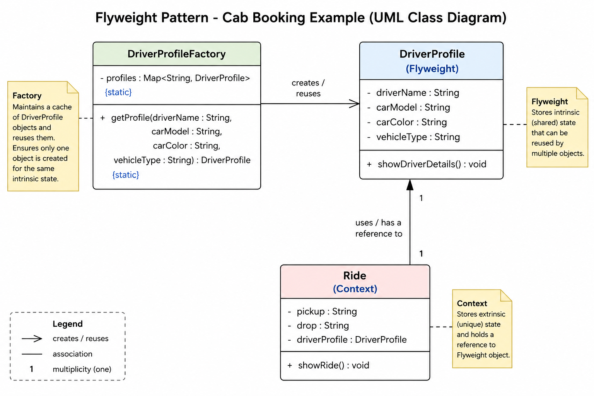

# Flyweight Design Pattern

## What is Flyweight?

Flyweight is a structural design pattern used to reduce memory usage by sharing common object data between multiple objects.

Instead of storing duplicate data again and again, Flyweight stores shared data once and reuses it.

---

# Core Idea

Separate object state into:

## Intrinsic State (Shared State)

Common reusable data.

Example:
- driver name
- car model
- car color
- vehicle type

This data is shared between multiple objects.

---

## Extrinsic State (Unique State)

Object-specific runtime data.

Example:
- pickup location
- drop location

This data changes for every object.

---

# Problem Without Flyweight

Suppose a cab booking app has thousands of rides.

Without Flyweight:

```text
Ride1 -> Amit, Swift, White, Sedan
Ride2 -> Amit, Swift, White, Sedan
Ride3 -> Amit, Swift, White, Sedan
```

Same driver/car information gets stored repeatedly.

This causes:
- memory waste
- duplicate objects
- poor scalability

---

# Flyweight Solution

Store shared driver/car data only once.

All rides reuse the same object.

---

# Mental Model

Instead of:

```text
1000 rides storing same driver details
```

Do:

```text
1000 rides pointing to ONE shared DriverProfile object
```

That is Flyweight.

---

# Example Scenario

Cab Booking System

## Shared Data
- Driver Name
- Car Model
- Car Color
- Vehicle Type

Stored inside:

```java
DriverProfile
```

---

## Unique Data
- Pickup
- Drop

Stored inside:

```java
Ride
```

---

# Structure

```text
Ride
 ├── pickup
 ├── drop
 └── DriverProfile reference

DriverProfile
 ├── driverName
 ├── carModel
 ├── carColor
 └── vehicleType
```

---

# Components

## DriverProfile (Flyweight)

Stores shared reusable data.

```java
public class DriverProfile {

    private String driverName;
    private String carModel;
    private String carColor;
    private String vehicleType;

    public DriverProfile(String driverName,
                         String carModel,
                         String carColor,
                         String vehicleType) {

        this.driverName = driverName;
        this.carModel = carModel;
        this.carColor = carColor;
        this.vehicleType = vehicleType;
    }

    public void showDriverDetails() {

        System.out.println(
                driverName + " | " +
                carModel + " | " +
                carColor + " | " +
                vehicleType
        );
    }
}
```

---

# Why this class exists

This class stores repeated common data that should be shared instead of duplicated.

---

## DriverProfileFactory (Flyweight Factory)

Responsible for:
- caching objects
- reusing objects
- preventing duplicates

```java
import java.util.HashMap;
import java.util.Map;

public class DriverProfileFactory {

    private static Map<String, DriverProfile> profiles =
            new HashMap<>();

    public static DriverProfile getProfile(
            String driverName,
            String carModel,
            String carColor,
            String vehicleType) {

        String key =
                driverName +
                carModel +
                carColor +
                vehicleType;

        if (!profiles.containsKey(key)) {

            System.out.println(
                    "Creating new DriverProfile object"
            );

            DriverProfile profile =
                    new DriverProfile(
                            driverName,
                            carModel,
                            carColor,
                            vehicleType
                    );

            profiles.put(key, profile);
        }

        return profiles.get(key);
    }
}
```

---

# Why static is used

Factory manages a global shared cache.

```java
private static Map<String, DriverProfile>
```

means:

```text
Only ONE cache exists in entire application
```

This allows all rides to reuse same objects.

If factory objects were created separately:

```java
new DriverProfileFactory()
```

each factory would have its own cache and Flyweight optimization would fail.

---

## Ride (Context Object)

Stores unique runtime data.

```java
public class Ride {

    private String pickup;
    private String drop;

    private DriverProfile driverProfile;

    public Ride(String pickup,
                String drop,
                DriverProfile driverProfile) {

        this.pickup = pickup;
        this.drop = drop;
        this.driverProfile = driverProfile;
    }

    public void showRide() {

        System.out.println(
                "Pickup: " + pickup +
                ", Drop: " + drop
        );

        driverProfile.showDriverDetails();

        System.out.println();
    }
}
```

---

# Why this class exists

Ride stores:
- unique ride information
- reference to shared DriverProfile

It avoids storing duplicate driver data.

---

## Main Class

```java
public class Main {

    public static void main(String[] args) {

        DriverProfile profile1 =
                DriverProfileFactory.getProfile(
                        "Amit",
                        "Swift",
                        "White",
                        "Sedan"
                );

        Ride ride1 =
                new Ride(
                        "Delhi",
                        "Noida",
                        profile1
                );

        DriverProfile profile2 =
                DriverProfileFactory.getProfile(
                        "Amit",
                        "Swift",
                        "White",
                        "Sedan"
                );

        Ride ride2 =
                new Ride(
                        "Gurgaon",
                        "Faridabad",
                        profile2
                );

        ride1.showRide();
        ride2.showRide();

        System.out.println(profile1 == profile2);
    }
}
```

---

# Execution Flow

## Step 1

Ride requests DriverProfile from factory.

```java
DriverProfileFactory.getProfile(...)
```

---

## Step 2

Factory checks cache.

If object exists:
- reuse it

Else:
- create new object
- store in cache

---

## Step 3

Ride stores:
- pickup
- drop
- reference to shared DriverProfile

---

## Step 4

Multiple rides reuse same DriverProfile object.

---

# Output

```text
Creating new DriverProfile object

Pickup: Delhi, Drop: Noida
Amit | Swift | White | Sedan

Pickup: Gurgaon, Drop: Faridabad
Amit | Swift | White | Sedan

true
```

---

# Important Understanding

```java
profile1 == profile2
```

returns:

```text
true
```

Meaning:
both rides are using SAME shared object.

---

# Memory Visualization

## Without Flyweight

```text
Ride1
 ├── Amit
 ├── Swift
 ├── White
 └── Sedan

Ride2
 ├── Amit
 ├── Swift
 ├── White
 └── Sedan
```

Duplicate data everywhere.

---

## With Flyweight

```text
                +-------------------+
                |   DriverProfile   |
                | Amit              |
                | Swift             |
                | White             |
                | Sedan             |
                +-------------------+
                     ^         ^
                     |         |
                  Ride1     Ride2
```

One shared object reused everywhere.

---

# Why Composition is Used

Ride contains:

```java
DriverProfile driverProfile;
```

instead of:

```java
class Ride extends DriverProfile
```

Because:

```text
Ride IS NOT A DriverProfile
```

It only uses DriverProfile.

This is HAS-A relationship.

Flyweight heavily relies on composition for sharing objects.

---

# Advantages

- Reduces memory usage
- Avoids duplicate objects
- Improves scalability
- Faster object reuse

---

# Disadvantages

- Adds design complexity
- Requires proper state separation
- Shared objects should ideally be immutable

---

# When to Use

Use Flyweight when:
- huge number of similar objects exist
- repeated data exists
- memory optimization is important
- object creation cost is high

---

# Real-world Examples

- JVM String Pool
- Game engines
- Text editors
- Icon rendering systems
- Map marker systems
- Bullet systems in games

---

# Interview Points

## What is Flyweight?

A pattern that reduces memory usage by sharing common object state.

---

## Intrinsic vs Extrinsic State

### Intrinsic
Shared reusable state.

### Extrinsic
Unique runtime state.

---

## Why use static factory?

To maintain one global shared cache of flyweight objects.

---

## Is Java String Pool Flyweight?

Yes.

```java
String a = "hello";
String b = "hello";
```

Both point to same object.

---

# UML Diagram

```text
+----------------------+
| DriverProfileFactory |
+----------------------+
| - profiles           |
+----------------------+
| + getProfile()       |
+----------------------+
            |
            | creates/reuses
            v

+----------------------+
|    DriverProfile     |
+----------------------+
| - driverName         |
| - carModel           |
| - carColor           |
| - vehicleType        |
+----------------------+
| + showDriverDetails()|
+----------------------+

            ^
            |
            | shared reference
            |

+----------------------+
|         Ride         |
+----------------------+
| - pickup             |
| - drop               |
| - driverProfile      |
+----------------------+
| + showRide()         |
+----------------------+
```

---

# Final Intuition

Flyweight means:

```text
Store repeated common data once
and share it across multiple objects.
```
# Class Diagram
