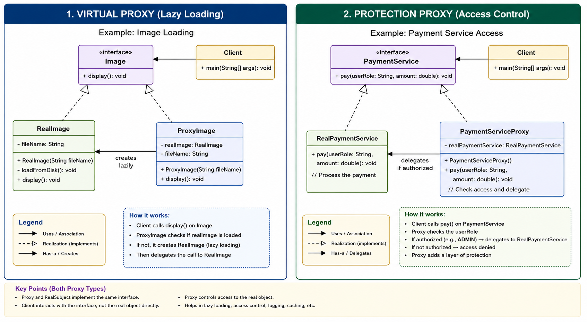

# Proxy Design Pattern

## 1. What is Proxy Design Pattern?

The Proxy Design Pattern is a Structural Design Pattern that provides a substitute or placeholder object to control access to another object.

In simple words:

A proxy is an object that stands between the client and the real object.

The client does not directly talk to the real object.

Instead, the client talks to the proxy.

The proxy then decides:
- whether to call the real object
- when to call the real object
- how to call the real object
- whether to block the request
- whether to return cached data
- whether to log the request
- whether to apply rate limiting
- whether to create the real object lazily
- whether to forward the request to a remote service

Basic flow:

Client -> Proxy -> Real Object

The proxy and the real object usually implement the same interface.

This allows the proxy to be used wherever the real object is expected.

---

## 2. Core Definition

Proxy Pattern provides controlled access to a real object through another object that implements the same interface.

The real object is called the Real Subject.

The proxy object is called the Proxy.

The common interface is called the Subject.

---

## 3. Simple Real-Life Meaning

Proxy means representative.

Example:

If you want to meet a CEO, you may first talk to the receptionist.

You -> Receptionist -> CEO

The receptionist controls access to the CEO.

The receptionist may:
- check if you have an appointment
- ask why you want to meet
- block you
- forward your request
- schedule a meeting
- answer basic questions without disturbing the CEO

Here:
- You are the client
- Receptionist is the proxy
- CEO is the real object

The receptionist is not the CEO, but controls access to the CEO.

That is the Proxy Pattern.

---

## 4. Why is Proxy Pattern Used?

Proxy Pattern is used when direct access to an object is not ideal.

Direct access may be problematic because:

1. The object is expensive to create.
2. The object should be created only when needed.
3. The object contains sensitive operations.
4. Access should be allowed only for specific users.
5. The object is located on another server.
6. The result should be cached.
7. Method calls should be logged.
8. Requests should be rate-limited.
9. Extra checks are needed before calling the real object.
10. Client code should remain simple.

Instead of putting all these responsibilities inside the real object, we put them inside a proxy.

This keeps the real object focused on actual business logic.

---

## 5. What Problem Does Proxy Pattern Solve?

### Problem 1: Expensive Object Creation

Suppose an image object loads a large image from disk.

Without proxy:

RealImage image = new RealImage("large-image.png");

The image gets loaded immediately.

Even if the image is never displayed, the expensive loading already happened.

This wastes memory and time.

With proxy:

Image image = new ProxyImage("large-image.png");

The real image is not loaded immediately.

It is loaded only when:

image.display();

is called.

This is lazy loading.

---

### Problem 2: Access Control

Suppose only ADMIN users should access a payment service.

Without proxy, the client may directly call:

paymentService.pay();

This is risky because every caller can access the payment service.

With proxy:

Client -> PaymentServiceProxy -> RealPaymentService

The proxy checks:

Is the user ADMIN?

If yes, it calls the real service.

If no, it blocks the request.

---

### Problem 3: Caching

Suppose fetching product details from database is expensive.

Without proxy:

Every call hits the database.

With proxy:

First call:
Client -> Proxy -> Database

Second call:
Client -> Proxy -> Cache

The proxy avoids unnecessary database calls.

---

### Problem 4: Logging

Suppose every payment request should be logged.

Without proxy, logging code may be mixed with business logic.

With proxy:

Proxy logs request
Proxy calls real payment service
Proxy logs response

Real service remains clean.

---

### Problem 5: Remote Object Access

Suppose a service is located on another server.

The client should not handle:
- HTTP call
- serialization
- deserialization
- timeout
- retry
- network errors

A remote proxy hides this complexity.

Client feels like it is calling a local object.

---

## 6. Main Intent of Proxy Pattern

The main intent of Proxy Pattern is:

To control access to a real object without changing the client code.

Important:

Proxy is not mainly about adding new features.

Proxy is mainly about controlling access.

The control can be:
- lazy loading
- access control
- caching
- logging
- rate limiting
- remote communication
- monitoring
- validation

---

## 7. Key Principle: Same Interface Principle

The proxy and the real subject should implement the same interface.
```text
Example:

interface Image {
void display();
}

class RealImage implements Image {
public void display() {
// actual display
}
}

class ProxyImage implements Image {
public void display() {
// control logic
// delegate to RealImage
}
}
```
Client code:
```text
Image image = new ProxyImage("photo.png");
image.display();
```
The client depends only on Image interface.

The client does not care whether it is using:
- RealImage
- ProxyImage

This is the most important design idea in Proxy Pattern.

---

## 8. Structure of Proxy Pattern

The Proxy Pattern has four main parts:

1. Subject Interface
2. Real Subject
3. Proxy
4. Client

---

## 9. Subject Interface

The Subject Interface defines the common operations.

Both the Real Subject and Proxy implement this interface.

Example:

public interface Image {
void display();
}

Responsibilities:
- defines common contract
- allows proxy to replace real object
- helps client depend on abstraction
- supports loose coupling

Why interface is needed:

If both proxy and real object implement the same interface, then client code can work with either one.

This makes substitution possible.

---

## 10. Real Subject

The Real Subject is the actual object that performs the real work.

Example:

public class RealImage implements Image {
public void display() {
System.out.println("Displaying image");
}
}

Responsibilities:
- contains actual business logic
- performs the real operation
- does not usually handle access control
- does not usually handle logging
- does not usually handle caching
- does not usually handle rate limiting

The real subject should focus only on its core responsibility.

---

## 11. Proxy

The Proxy controls access to the Real Subject.

Example:

public class ProxyImage implements Image {
private RealImage realImage;

    public void display() {
        if (realImage == null) {
            realImage = new RealImage();
        }

        realImage.display();
    }
}

Responsibilities:
- implements the same interface as real subject
- holds reference to real subject
- controls when real subject is created
- controls whether real subject is called
- adds access control if needed
- adds logging if needed
- adds caching if needed
- adds rate limiting if needed
- delegates actual work to real subject

---

## 12. Client

The Client uses the Subject Interface.

Example:

Image image = new ProxyImage("photo.png");
image.display();

Responsibilities:
- calls methods on the interface
- does not directly manage the real object
- does not know proxy internals
- remains simple

The client should not directly depend on RealSubject.

Good:

Image image = new ProxyImage("photo.png");

Bad:

RealImage image = new RealImage("photo.png");

---

## 13. Basic Flow

General flow:
```text
Client calls method on Subject interface
|
v
Proxy receives the request
|
v
Proxy performs control logic
|
v
Proxy decides whether to call Real Subject
|
v
Real Subject performs actual work
|
v
Result returns to Proxy
|
v
Proxy returns result to Client
```
---

## 14. Object Interaction Flow

Example with image loading:

Step 1:
Client creates ProxyImage.

Step 2:
ProxyImage stores file name.

Step 3:
RealImage is not created yet.

Step 4:
Client calls display().

Step 5:
ProxyImage receives display() call.

Step 6:
ProxyImage checks if RealImage exists.

Step 7:
If RealImage does not exist, ProxyImage creates it.

Step 8:
RealImage loads image from disk.

Step 9:
ProxyImage calls RealImage.display().

Step 10:
RealImage displays image.

---

## 15. Types of Proxy

Common types of proxy:

1. Virtual Proxy
2. Protection Proxy
3. Caching Proxy
4. Logging Proxy
5. Rate Limiting Proxy
6. Remote Proxy
7. Smart Proxy

---

# 16. Virtual Proxy

## What is Virtual Proxy?

A Virtual Proxy delays the creation of an expensive object until it is actually needed.

This is also called lazy loading.

## Problem

Some objects are expensive to create.

Examples:
- large images
- videos
- PDF files
- database connections
- heavy reports
- machine learning models
- large configuration files

Creating them immediately may waste memory and time.

## Solution

Create a lightweight proxy first.

The proxy creates the real object only when required.

## Example

Image image = new ProxyImage("large-image.png");

At this point:
- ProxyImage is created
- RealImage is not created
- Image is not loaded from disk

When this is called:

image.display();

Then:
- Proxy creates RealImage
- RealImage loads image
- RealImage displays image

## Flow
```text
Client creates ProxyImage
|
v
RealImage is not created
|
v
Client calls display()
|
v
Proxy creates RealImage
|
v
RealImage loads heavy resource
|
v
RealImage displays image
```
## Use Cases

- image loading
- video loading
- PDF viewer
- Hibernate lazy loading
- database lazy connection
- cloud file loading
- expensive object creation
- ML model loading

---

# 17. Protection Proxy

## What is Protection Proxy?

A Protection Proxy controls access to an object based on permissions.

## Problem

Some operations should be accessible only to specific users.

Examples:
- only ADMIN can delete user
- only MANAGER can view salary
- only OWNER can update account
- only verified user can make payment

## Solution

Place a proxy before the real service.

The proxy checks permissions before calling the real object.

## Flow
```text
Client calls service
|
v
Proxy checks user role
|
v
If allowed, call real service
|
v
If not allowed, block request
```
## Example

Client -> PaymentServiceProxy -> RealPaymentService

Proxy checks:

if userRole is ADMIN:
call real service
else:
deny access

## Use Cases

- admin dashboards
- banking systems
- payment systems
- salary systems
- user management
- role-based access control
- secure APIs

---

# 18. Caching Proxy

## What is Caching Proxy?

A Caching Proxy stores results of expensive operations and returns cached results for repeated calls.

## Problem

Repeated calls to database or external API can be expensive.

Example:

getProductById(101)

If the product does not change frequently, hitting the database every time is wasteful.

## Solution

Proxy checks cache first.

If data exists in cache:
- return cached data

If data does not exist:
- call real service
- store result in cache
- return result

## Flow
```text
Client calls getProduct(101)
|
v
Proxy checks cache
|
v
If found, return cached product
|
v
If not found, call real service
|
v
Real service fetches from DB/API
|
v
Proxy stores result in cache
|
v
Proxy returns result
```
## Use Cases

- product catalog
- user profile
- exchange rates
- weather data
- configuration service
- database query results
- API responses

---

# 19. Logging Proxy

## What is Logging Proxy?

A Logging Proxy logs method calls before and/or after calling the real object.

## Problem

Logging inside every service method creates duplicate and messy code.

Example:

public void pay() {
log start
business logic
log end
}

This mixes logging with business logic.

## Solution

Move logging to proxy.

Proxy:
- logs request
- calls real object
- logs response

## Flow
```text
Client calls method
|
v
Proxy logs request
|
v
Proxy calls real service
|
v
Real service performs work
|
v
Proxy logs completion
```
## Use Cases

- audit logging
- payment logs
- debugging
- monitoring
- API call tracking
- enterprise observability

---

# 20. Rate Limiting Proxy

## What is Rate Limiting Proxy?

A Rate Limiting Proxy limits how many times a client can access a service in a given time.

## Problem

Some operations should not be called unlimited times.

Examples:
- OTP request
- login attempt
- payment retry
- API call
- password reset email

Without rate limiting, users can abuse the system.

## Solution

Proxy tracks request count.

If user is within limit:
- allow request

If user exceeds limit:
- reject request

## Flow
```text
Client calls service
|
v
Proxy checks request count
|
v
If limit not exceeded, call real service
|
v
If limit exceeded, reject request
```
## Use Cases

- OTP services
- login APIs
- public APIs
- payment attempts
- download services
- email sending
- SMS sending

---

# 21. Remote Proxy

## What is Remote Proxy?

A Remote Proxy represents an object located on another machine or server.

The client calls the proxy as if it is a local object.

Internally, the proxy communicates with the remote object.

## Problem

Remote calls involve complexity:
- network request
- serialization
- deserialization
- timeout
- retry
- error handling
- authentication
- response mapping

Client should not handle all this complexity.

## Solution

Create a proxy that hides remote communication.

## Flow

```text
Client calls proxy method
|
v
Proxy converts method call into network request
|
v
Remote service processes request
|
v
Proxy receives response
|
v
Proxy converts response into local object
|
v
Client receives result

## Use Cases

- REST clients
- RPC clients
- microservice communication
- payment gateway clients
- cloud storage SDKs
- database drivers
- third-party API clients

---
```
# 22. Smart Proxy

## What is Smart Proxy?

A Smart Proxy adds extra behavior when accessing the real object.

This behavior may include:
- reference counting
- locking
- logging
- monitoring
- transaction handling
- resource cleanup
- object lifecycle management

## Example

Spring transaction proxy:

Client calls service method
|
v
Proxy starts transaction
|
v
Proxy calls real method
|
v
If success, proxy commits transaction
|
v
If failure, proxy rolls back transaction

## Use Cases

- Spring @Transactional
- monitoring proxy
- reference counting
- resource cleanup
- thread safety
- lifecycle management

---

# 23. Real-World Examples

## 1. ATM

ATM is a proxy for bank account.

User -> ATM -> Bank Server -> Account

ATM controls:
- authentication
- withdrawal limit
- balance inquiry
- transaction logging
- cash availability

User does not directly access the bank database.

---

## 2. Credit Card

Credit card is a proxy for bank account.

Customer -> Credit Card -> Bank Account

The card controls access to money.

It adds:
- spending limit
- fraud checks
- transaction logging
- delayed settlement

---

## 3. Browser Cache

Browser cache is a proxy for web resources.

User -> Browser Cache -> Web Server

If resource is cached, browser may return it without hitting server.

---

## 4. CDN

CDN is a proxy between user and origin server.

User -> CDN -> Origin Server

CDN handles:
- caching
- faster content delivery
- load reduction
- security
- DDoS protection

---

## 5. API Gateway

API Gateway is a proxy for backend microservices.

Client -> API Gateway -> Microservices

API Gateway handles:
- authentication
- authorization
- routing
- rate limiting
- logging
- load balancing
- request transformation

---

## 6. Nginx Reverse Proxy

Nginx can act as a reverse proxy.

Client -> Nginx -> Backend Server

Nginx handles:
- SSL termination
- load balancing
- routing
- compression
- caching
- request forwarding

---

## 7. Spring AOP Proxy

Spring uses proxies for features like:

@Transactional
@Cacheable
@Async
@PreAuthorize

Example with @Transactional:

Client -> Transaction Proxy -> Real Service

Proxy:
- starts transaction
- calls real method
- commits transaction if success
- rolls back transaction if exception

---

## 8. Hibernate Lazy Loading Proxy

Hibernate uses proxy-like behavior for lazy loading.

Example:

User user = userRepository.findById(1);
user.getOrders();

Orders may not be loaded immediately.

They may be loaded only when getOrders() is called.

This is virtual proxy behavior.

---

# 24. Backend Enterprise Usage

Proxy Pattern is very common in backend development.

## Common Backend Proxy Examples

1. Transaction proxy
2. Security proxy
3. Cache proxy
4. Logging proxy
5. Rate limiting proxy
6. API gateway proxy
7. Remote service proxy
8. Hibernate lazy loading proxy
9. Repository proxy
10. Monitoring proxy

---

## Spring Transaction Proxy Flow

Code:

@Transactional
public void placeOrder() {
inventoryService.reduceStock();
paymentService.charge();
orderRepository.save();
}

Conceptual flow:

```text
Client calls placeOrder()
|
v
Spring proxy intercepts call
|
v
Proxy starts transaction
|
v
Proxy calls real placeOrder()
|
v
If success, proxy commits transaction
|
v
If exception, proxy rolls back transaction

```
Important:

The transaction code is not inside your business method.

Spring proxy adds it around your method.

---

## Spring Cache Proxy Flow

Code:

@Cacheable("products")
public Product getProductById(Long id) {
return productRepository.findById(id);
}

Conceptual flow:

```text
Client calls getProductById(1)
|
v
Cache proxy checks cache
|
v
If product exists in cache, return it
|
v
If not, call real method
|
v
Store result in cache
|
v
Return result

---
```
## Spring Security Proxy Flow

Code:

@PreAuthorize("hasRole('ADMIN')")
public void deleteUser(Long userId) {
userRepository.deleteById(userId);
}

Conceptual flow:

```text
Client calls deleteUser()
|
v
Security proxy checks role
|
v
If ADMIN, call real method
|
v
If not ADMIN, deny access

---

# 25. UML-Style Class Diagram

## Generic Proxy Pattern

Client
|
v
Subject Interface
|-----------------------------|
|                             |
v                             v
RealSubject                  Proxy
|
v
RealSubject

Text diagram:

+----------------+
|     Client     |
+----------------+
|
v
+----------------+
|    Subject     |
|----------------|
| + request()    |
+----------------+
^     ^
|     |
|     |
+-------------+        +-------------+
| RealSubject |        |    Proxy    |
|-------------|        |-------------|
| + request() |        | - realObj   |
+-------------+        | + request() |
+-------------+
|
v
+-------------+
| RealSubject |
+-------------+

---

## Image Proxy Diagram

+----------------+
|     Client     |
+----------------+
|
v
+----------------+
|     Image      |
|----------------|
| + display()    |
+----------------+
^     ^
|     |
|     |
+-------------+        +-------------+
|  RealImage  |        | ProxyImage  |
|-------------|        |-------------|
| - fileName  |        | - fileName  |
| + display() |        | - realImage |
| - load()    |        | + display() |
+-------------+        +-------------+
|
v
creates RealImage
only when needed

---
```

# Class UML Diagram
